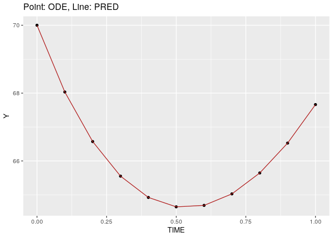
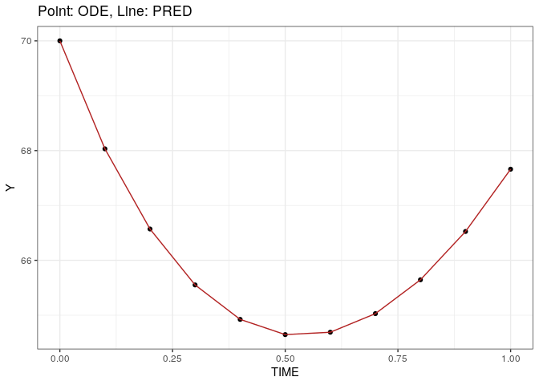

-   [1 Input data](#1-input-data)
    -   [1.1 Constant dose](#11-constant-dose)
    -   [1.2 Time-varying dose](#12-time-varying-dose)
-   [2 Constant dose](#2-constant-dose)
    -   [2.1 ODE](#21-ode)
    -   [2.2 PRED](#22-pred)
-   [3 Time-varying dose](#3-time-varying-dose)
    -   [3.1 ODE](#31-ode)
    -   [3.2 PRED](#32-pred)
-   [4 Plots](#4-plots)
    -   [4.1 Constant dose](#41-constant-dose)
    -   [4.2 Time-varying](#42-time-varying)
-   [5 Spot check analytical
    solution](#5-spot-check-analytical-solution)

``` r
library(dplyr)
library(data.table)
library(here)
library(ggplot2)

source(here("shared/tools.R"))
setwd(here("claret"))
```

# 1 Input data

## 1.1 Constant dose

``` r
data <- expand.grid(
  C = NA_character_,
  ID = 1, 
  TIME = seq(0,1, 0.1), 
  DOSE = 10, 
  CMT = 1, 
  EVID=0, 
  MDV = 1, 
  DV = NA_real_
)
```

## 1.2 Time-varying dose

``` r
data2 <- mutate(
  data, 
  DOSE = ifelse(TIME == 0.5, 5, DOSE)
)

fwrite(data, file = here("claret/data/claret001.csv"), na = '.', quote = FALSE)
fwrite(data2, file = here("claret/data/claret002.csv"), na = '.', quote = FALSE)
```

# 2 Constant dose

## 2.1 ODE

``` r
a <- psn_execute("c001")
```

## 2.2 PRED

``` r
b <- psn_execute("c002")
```

# 3 Time-varying dose

## 3.1 ODE

``` r
c <- psn_execute("c003")
```

## 3.2 PRED

``` r
d <- psn_execute("c004")
```

# 4 Plots

## 4.1 Constant dose

``` r
ggplot() + 
  geom_point(data = a, aes(TIME, Y)) + 
  geom_line(data = b,  aes(TIME, Y), color = "firebrick") + 
  ggtitle("Point: ODE, Line: PRED")
```

<!-- -->

## 4.2 Time-varying

``` r
ggplot() + 
  geom_point(data = c, aes(TIME, Y)) + 
  geom_line(data = d,  aes(TIME, Y), color = "firebrick") + 
  ggtitle("Point ODE; Line: PRED")
```

<!-- -->

# 5 Spot check analytical solution

``` r
KG = 0.6
KS0 = 0.4
GAMMA = 0.8
BASE = 70
RESP_0 = BASE
DOSE = 5

TIME = 0.5
KS = KS0 *exp( -GAMMA * TIME);
RESP_0 * exp((KG*TIME) - (KS0 * log(DOSE)/GAMMA) * (1-exp(-GAMMA*TIME)))
```

    ## [1] 72.47166

``` r
filter(d, TIME==0.5)
```

    ##    ID TIME      Y
    ## 1:  1  0.5 72.472

``` r
TIME = 0.4
DOSE = 10
KS = KS0 *exp( -GAMMA * TIME);
RESP_0 * exp((KG*TIME) - (KS0 * log(DOSE)/GAMMA) * (1-exp(-GAMMA*TIME)))
```

    ## [1] 64.9237

``` r
filter(d, TIME==0.4)
```

    ##    ID TIME      Y
    ## 1:  1  0.4 64.924

``` r
TIME = 1.0
DOSE = 10
KS = KS0 *exp( -GAMMA * TIME);
RESP_0 * exp((KG*TIME) - (KS0 * log(DOSE)/GAMMA) * (1-exp(-GAMMA*TIME)))
```

    ## [1] 67.66112

``` r
filter(d, TIME==1.0)
```

    ##    ID TIME      Y
    ## 1:  1    1 81.889
