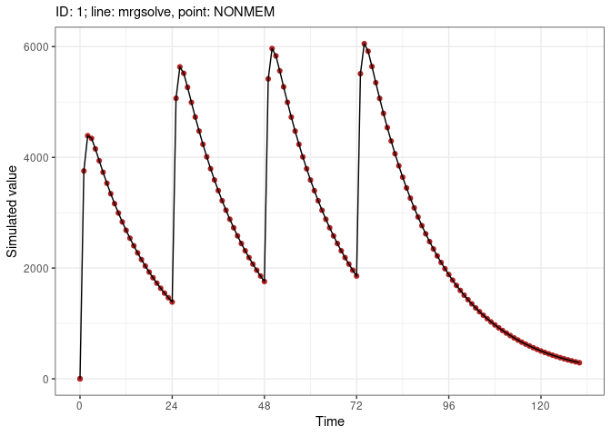
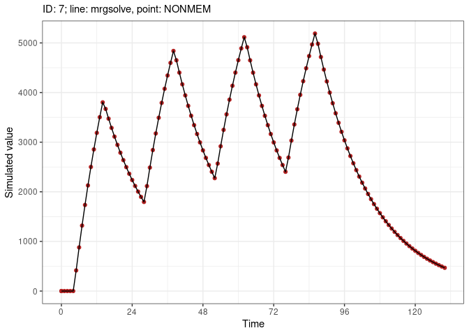
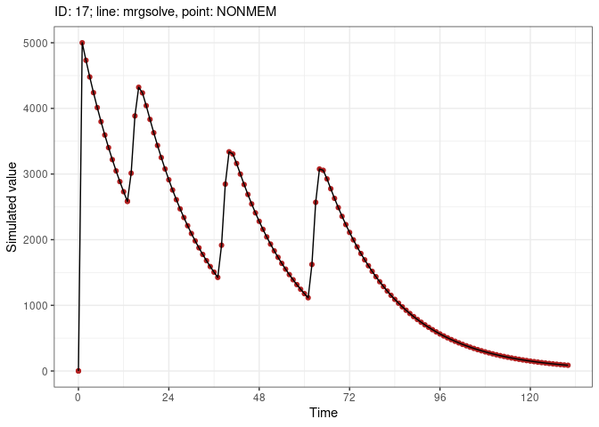
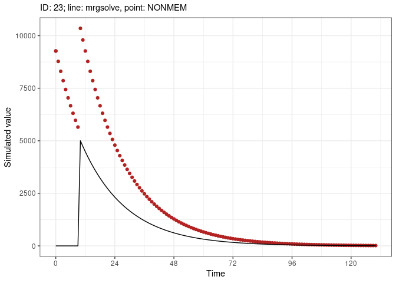
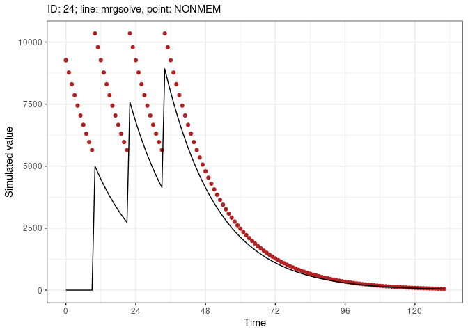
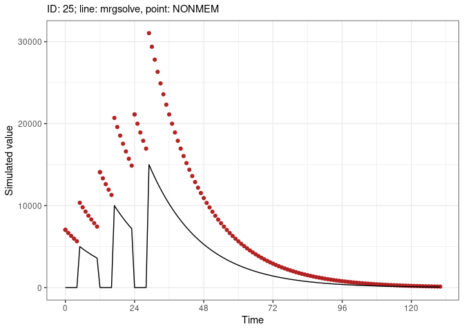

Benchmark test with mrgsolve and NONMEM
================
Metrum Research Group

- [Introduction](#introduction)
- [mrgsolve package version](#mrgsolve-package-version)
- [Setup](#setup)
- [The `mrgsim()` model](#the-mrgsim-model)
- [Simulate with `nonmem`](#simulate-with-nonmem)
- [Numeric Summary](#numeric-summary)
  - [Overall](#overall)
  - [Summary by scenario number](#summary-by-scenario-number)
- [Results](#results)
  - [1: Bolus with additional](#1-bolus-with-additional)
  - [2: Bolus with lag time and bioav](#2-bolus-with-lag-time-and-bioav)
  - [2: Bolus with lag time and
    bioav](#2-bolus-with-lag-time-and-bioav-1)
  - [4: Infusion with bioav factor](#4-infusion-with-bioav-factor)
  - [5: Infusion with bioav factor and
    dur](#5-infusion-with-bioav-factor-and-dur)
  - [7: Infusion doses, with additional and lag
    time](#7-infusion-doses-with-additional-and-lag-time)
  - [8: Infusion doses, with lag time and bioav
    factor](#8-infusion-doses-with-lag-time-and-bioav-factor)
  - [9: Infusion doses at steady-state, with lag time and bioav
    factor](#9-infusion-doses-at-steady-state-with-lag-time-and-bioav-factor)
  - [10: Infusion doses at steady-state, with bioav
    factor](#10-infusion-doses-at-steady-state-with-bioav-factor)
  - [11: Infusion doses at steady state, with lag
    time](#11-infusion-doses-at-steady-state-with-lag-time)
  - [12: Infusion doses at steady state, II \< DUR, no bioav
    factor](#12-infusion-doses-at-steady-state-ii--dur-no-bioav-factor)
  - [13: Infusion doses at steady state where II == DUR, with bioav
    factor](#13-infusion-doses-at-steady-state-where-ii--dur-with-bioav-factor)
  - [14: Infusion doses at steady state, where II ==
    DUR](#14-infusion-doses-at-steady-state-where-ii--dur)
  - [15: Bolus doses at steady state, with bioav factor and lag
    time](#15-bolus-doses-at-steady-state-with-bioav-factor-and-lag-time)
  - [16: Bolus doses with lag time and bioav
    factor](#16-bolus-doses-with-lag-time-and-bioav-factor)
  - [17: Bolus then infusion](#17-bolus-then-infusion)
  - [18: Infusion with modeled duration, lag time, and bioav
    factor](#18-infusion-with-modeled-duration-lag-time-and-bioav-factor)
  - [19: Infusion with modeled duration, at steady state with bioav
    factor](#19-infusion-with-modeled-duration-at-steady-state-with-bioav-factor)
  - [20: Reset and dose (EVID 4) with
    additional](#20-reset-and-dose-evid-4-with-additional)
  - [21: Reset and dose (EVID 4) with
    SS=1](#21-reset-and-dose-evid-4-with-ss1)
  - [22: Reset and dose (EVID 4) with SS=1 and
    ADDL](#22-reset-and-dose-evid-4-with-ss1-and-addl)
  - [23: Reset and dose (EVID 4) with SS=1 and
    LAG](#23-reset-and-dose-evid-4-with-ss1-and-lag)
  - [24: Reset and dose (EVID 4) with SS=1, ADDL and
    LAG](#24-reset-and-dose-evid-4-with-ss1-addl-and-lag)
  - [25: Reset (EVID 3) with
    additional](#25-reset-evid-3-with-additional)
  - [26: Reset (EVID 3) with additional and
    lag](#26-reset-evid-3-with-additional-and-lag)
  - [27: Steady state 1 and 2](#27-steady-state-1-and-2)
  - [28: Steady state infusion](#28-steady-state-infusion)
- [Control stream](#control-stream)
- [Session Info](#session-info)

# Introduction

This document runs simulations from a pharmacokinetic model using both
NONMEM and mrgsolve and compares the results. The benchmarks in this set
focus on dosing events (bolus and infusion), bioavailability, lag times,
reset and steady state,

All of the relevant code is presented so that the user can trace how the
simulations are performed. The complete source code can be viewed
[here](dosing/dosing-vignette.R).

The bottom line results are presented in graphical form [here](#results)
and numeric form [here](#numeric-summary).

# mrgsolve package version

``` r
packageVersion("mrgsolve")
```

    ## [1] '1.5.2'

# Setup

``` r
Sys.setenv(RSTUDIO_PANDOC = "/usr/lib/rstudio-server/bin/pandoc")
```

``` r
mrgsolve.loc <- NULL # "/data/home/Rlibs/"
library(mrgsolve, lib.loc = mrgsolve.loc)
```

``` r
library(dplyr)
library(data.table)
library(ggplot2)
library(purrr)
library(tidyr)
library(jsonlite)
library(tools)
library(here)
library(knitr)
```

``` r
stopifnot(grepl("PsN", system("execute --version", intern = TRUE)))
stopifnot(file.exists("locate-dosing"))
source(here("shared", "tools.R"))
source(here("shared", "data.R"))
```

# The `mrgsim()` model

``` r
mod <- mread_cache("1001.mod")
```

    . Building 1001_mod ... done.

``` r
mod <- update(mod, end = 130, delta = 1)

runs <- data_1001()
runs <- mutate(runs, sims = lapply(ev, sim, x = mod))
runs <- mutate(runs, data = map(sims, to_data_set))
```

``` r
data <- bind_rows(runs$data)
data$CP <- NULL

fsave(data, "data/1001.csv")
```

# Simulate with `nonmem`

``` r
nm <- psn_execute(1001)
```

# Numeric Summary

Look at the difference between simulated values from mrgsolve and
NONMEM.

``` r
runs <- mutate(runs, nm = split(nm, nm$ID))

runs <- mutate(
  runs, 
  comp = map2(nm, sims, .f = function(nonmem, mrgsolve) {
    tibble(
      ID = nonmem$ID, 
      time = mrgsolve$time, 
      MRGSIM = mrgsolve$CP, 
      NONMEM = nonmem$CP, 
      diff = MRGSIM-NONMEM
    )  
  })
)

comp <- select(runs, comp) %>% unnest(cols = c(comp))
```

## Overall

This is the `nonmem` minus `mrgsim()` summary

``` r
summary(comp$diff)
```

    .    Min. 1st Qu.  Median    Mean 3rd Qu.    Max. 
    . -9270.8     0.0     0.0   -98.5     0.0     0.0

## Summary by scenario number

`diff` is the simulated `CP` from `nonmem` minus the simulated `CP` from
`mrgsim()`

``` r
group_by(comp, ID) %>% 
  summarise(mean = mean(diff), max = max(diff), min = min(diff)) %>% 
  kable()
```

|  ID |      mean |     max |     min |
|----:|----------:|--------:|--------:|
|   1 |     0.000 |  0.0000 |     0.0 |
|   2 |     0.000 |  0.0000 |     0.0 |
|   3 |     0.000 |  0.0000 |     0.0 |
|   4 |     0.000 |  0.0000 |     0.0 |
|   5 |     0.000 |  0.0000 |     0.0 |
|   6 |     0.000 |  0.0000 |     0.0 |
|   7 |     0.000 |  0.0000 |     0.0 |
|   8 |     0.000 |  0.0000 |     0.0 |
|   9 |     0.000 |  0.0000 |     0.0 |
|  10 |     0.000 |  0.0000 |     0.0 |
|  11 |     0.000 |  0.0000 |     0.0 |
|  12 |     0.000 |  0.0000 |     0.0 |
|  13 |     0.000 |  0.0000 |     0.0 |
|  14 |     0.000 |  0.0000 |     0.0 |
|  15 |     0.000 |  0.0000 |     0.0 |
|  16 |     0.000 |  0.0000 |     0.0 |
|  17 |     0.000 |  0.0000 |     0.0 |
|  18 |     0.000 |  0.0000 |     0.0 |
|  19 |     0.000 |  0.0000 |     0.0 |
|  20 |     0.000 |  0.0000 |     0.0 |
|  21 |     0.000 |  0.0000 |     0.0 |
|  22 |     0.000 |  0.0000 |     0.0 |
|  23 | -1381.665 | -7.2762 | -9270.8 |
|  24 | -1381.669 | -7.2760 | -9270.8 |
|  25 |     0.000 |  0.0000 |     0.0 |
|  26 |     0.000 |  0.0000 |     0.0 |
|  27 |     0.000 |  0.0000 |     0.0 |
|  28 |     0.000 |  0.0000 |     0.0 |

``` r
runs <- mutate(runs, plot = map(comp, comp_plot))
```

# Results

## 1: Bolus with additional

    . $ev
    . Events:
    .   ID time amt ii addl cmt evid
    . 1  1    0 100 24    3   1    1
    . 
    . $plot

<!-- -->

## 2: Bolus with lag time and bioav

    . $ev
    . Events:
    .   ID time amt ii addl cmt evid  LAGT BIOAV
    . 1  2    0 100 24    3   2    1 12.13  2.23
    . 
    . $plot

<!-- -->

## 2: Bolus with lag time and bioav

    . $ev
    . Events:
    .   ID time amt ii addl cmt evid  LAGT BIOAV
    . 1  2    0 100 24    3   2    1 12.13  2.23
    . 
    . $plot

<!-- -->

## 4: Infusion with bioav factor

    . $ev
    . Events:
    .   ID time amt rate ii addl cmt evid BIOAV
    . 1  4    0 480   10  0    0   2    1   0.5
    . 
    . $plot

<!-- -->

## 5: Infusion with bioav factor and dur

    . $ev
    . Events:
    .   ID time amt rate ii addl cmt evid BIOAV MODE DUR2
    . 1  5    0 480   -2  0    0   2    1   0.5    2   48
    . 
    . $plot

<!-- -->

## 7: Infusion doses, with additional and lag time

    . $ev
    . Events:
    .   ID time amt rate ii addl cmt evid LAGT
    . 1  7    0 100   10 24    3   2    1 4.15
    . 
    . $plot

<!-- -->

## 8: Infusion doses, with lag time and bioav factor

    . $ev
    . Events:
    .   ID time amt rate ii addl cmt evid LAGT BIOAV
    . 1  8    0 100   10 24    3   2    1 3.25 0.412
    . 
    . $plot

<!-- -->

## 9: Infusion doses at steady-state, with lag time and bioav factor

    . $ev
    . Events:
    .   ID time amt rate ii ss addl cmt evid LAGT BIOAV
    . 1  9    0 100   10 24  1    3   2    1 3.16 0.412
    . 
    . $plot

<!-- -->

## 10: Infusion doses at steady-state, with bioav factor

    . $ev
    . Events:
    .   ID time amt rate ii ss addl cmt evid BIOAV
    . 1 10    0 100    2 12  1    4   2    1 0.812
    . 
    . $plot

<!-- -->

## 11: Infusion doses at steady state, with lag time

    . $ev
    . Events:
    .   ID time amt rate ii ss addl cmt evid
    . 1 11    0 100    2 12  1    3   2    1
    . 
    . $plot

<!-- -->

## 12: Infusion doses at steady state, II \< DUR, no bioav factor

    . $ev
    . Events:
    .   ID time amt   rate ii ss addl cmt evid
    . 1 12    0 100 8.3333  6  1   12   2    1
    . 
    . $plot

<!-- -->

## 13: Infusion doses at steady state where II == DUR, with bioav factor

    . $ev
    . Events:
    .   ID time amt rate ii ss addl cmt evid BIOAV
    . 1 13    0 100 4.12 10  1    8   2    1 0.412
    . 
    . $plot

<!-- -->

## 14: Infusion doses at steady state, where II == DUR

    . $ev
    . Events:
    .   ID time amt rate ii ss addl cmt evid
    . 1 14    0 100   10 10  1    8   2    1
    . 
    . $plot

<!-- -->

## 15: Bolus doses at steady state, with bioav factor and lag time

    . $ev
    . Events:
    .   ID time amt ii ss addl cmt evid LAGT BIOAV
    . 1 15    0 100 24  1    3   2    1    4 0.412
    . 
    . $plot

<!-- -->

## 16: Bolus doses with lag time and bioav factor

    . $ev
    . Events:
    .   ID time amt ii addl cmt evid LAGT BIOAV
    . 1 16    0 100 24    3   2    1    5 0.412
    . 
    . $plot

<!-- -->

## 17: Bolus then infusion

    . $ev
    . Events:
    .   ID time amt rate ii addl cmt evid LAGT
    . 1 17    0 100    0  0    0   2    1    1
    . 2 17   13  50   24 24    2   1    1    0
    . 
    . $plot

<!-- -->

## 18: Infusion with modeled duration, lag time, and bioav factor

    . $ev
    . Events:
    .   ID time amt rate ii addl cmt evid DUR2 MODE LAGT BIOAV
    . 1 18    0 100   -2 24    3   2    1    9    2    5  0.61
    . 
    . $plot

<!-- -->

## 19: Infusion with modeled duration, at steady state with bioav factor

    . $ev
    . Events:
    .   ID time amt rate ii ss addl cmt evid DUR2 MODE BIOAV
    . 1 19    0 100   -2 24  1    3   2    1    9    2  0.61
    . 
    . $plot

<!-- -->

## 20: Reset and dose (EVID 4) with additional

    . $ev
    . Events:
    .   ID time amt rate ii addl cmt evid BIOAV
    . 1 20    0 100   50 12    2   1    1  0.61
    . 2 20   50 120    0 12    3   1    4  0.50
    . 
    . $plot

<!-- -->

## 21: Reset and dose (EVID 4) with SS=1

    . $ev
    . Events:
    .   ID time amt ii ss cmt evid
    . 1 21    0 100 12  1   1    4
    . 
    . $plot

<!-- -->

## 22: Reset and dose (EVID 4) with SS=1 and ADDL

    . $ev
    . Events:
    .   ID time amt ii ss addl cmt evid
    . 1 22    0 100 12  1    2   1    4
    . 
    . $plot

<!-- -->

## 23: Reset and dose (EVID 4) with SS=1 and LAG

    . $ev
    . Events:
    .   ID time amt ii ss cmt evid LAGT
    . 1 23    0 100 12  1   2    4   10
    . 
    . $plot

<!-- -->

## 24: Reset and dose (EVID 4) with SS=1, ADDL and LAG

    . $ev
    . Events:
    .   ID time amt ii ss addl cmt evid LAGT
    . 1 24    0 100 12  1    2   2    4   10
    . 
    . $plot

<!-- -->

## 25: Reset (EVID 3) with additional

    . $ev
    . Events:
    .   ID time amt rate ii addl cmt evid BIOAV
    . 1 25    0 100   50 12    3   1    1  0.61
    . 2 25   50   0    0  0    0   2    3  1.00
    . 3 25   54 120    0 16    2   1    1  1.00
    . 
    . $plot

<!-- -->

## 26: Reset (EVID 3) with additional and lag

    . $ev
    . Events:
    .   ID time amt rate ii addl cmt evid BIOAV LAGT
    . 1 26    0 100   50 12    3   1    1  0.61   10
    . 2 26   50   0    0  0    0   2    3  1.00   10
    . 3 26   54 120    0 16    2   1    1  1.00   10
    . 
    . $plot

<!-- -->

## 27: Steady state 1 and 2

    . $ev
    . Events:
    .   ID time amt ii ss addl cmt evid
    . 1 27    0 100 24  1    3   1    1
    . 2 27   12  50 24  2    3   1    1
    . 
    . $plot

<!-- -->

## 28: Steady state infusion

    . $ev
    . Events:
    .   ID time amt rate ss cmt evid
    . 1 28    0   0  100  1   1    1
    . 
    . $plot

<!-- -->

# Control stream

``` r
writeLines(readLines("1001/1001.lst"))
```

       Tue 18 Feb 2025 09:11:43 AM EST
       $PROBLEM    RUN# 101
       $INPUT      C ID TIME EVID AMT CMT SS II ADDL RATE LAGT MODE DUR2 RAT2
                   BIOAV DV
       $DATA      1001.csv IGNORE=C
       $SUBROUTINE ADVAN2 TRANS2
       $PK
       
       TVCL=THETA(1)
       CL=TVCL*EXP(ETA(1))
       
       TVV2=THETA(2)
       V=TVV2*EXP(ETA(2))
       
       TVKA=THETA(3)
       KA=TVKA*EXP(ETA(3))
       
       ALAG2 = LAGT
       F2 = BIOAV
       
       IF(MODE.EQ.1) R2 = RAT2
       IF(MODE.EQ.2) D2 = DUR2
       
       $ERROR
       IPRED=A(2)/(V/1000)
       Y=IPRED*EXP(ERR(1))
       
       CP = IPRED
       
       $THETA  1.1 FIX ; ; CL
        20 FIX ; _; V
        1.5 FIX ; __; KA
       $OMEGA  0.0  FIX
        0.0  FIX
        0.0  FIX
       $SIGMA  0.00  FIX
       $TABLE      FILE=TAB ID TIME CP NOPRINT ONEHEADER NOAPPEND
       $SIMULATION (2674474) ONLYSIMULATION
       
       
       NM-TRAN MESSAGES
         
        WARNINGS AND ERRORS (IF ANY) FOR PROBLEM    1
                    
        (WARNING  2) NM-TRAN INFERS THAT THE DATA ARE POPULATION.
         
       Note: Analytical 2nd Derivatives are constructed in FSUBS but are never used.
             You may insert $ABBR DERIV2=NO after the first $PROB to save FSUBS construction and compilation time
         
       
       License Registered to: Metrum Research Group (with RADAR5NM)
       Expiration Date:    14 JUL 2025
       Current Date:       18 FEB 2025
       Days until program expires : 146
       1NONLINEAR MIXED EFFECTS MODEL PROGRAM (NONMEM) VERSION 7.5.1
        ORIGINALLY DEVELOPED BY STUART BEAL, LEWIS SHEINER, AND ALISON BOECKMANN
        CURRENT DEVELOPERS ARE ROBERT BAUER, ICON DEVELOPMENT SOLUTIONS,
        AND ALISON BOECKMANN. IMPLEMENTATION, EFFICIENCY, AND STANDARDIZATION
        PERFORMED BY NOUS INFOSYSTEMS.
       
        PROBLEM NO.:         1
        RUN# 101
       0DATA CHECKOUT RUN:              NO
        DATA SET LOCATED ON UNIT NO.:    2
        THIS UNIT TO BE REWOUND:        NO
        NO. OF DATA RECS IN DATA SET:     3703
        NO. OF DATA ITEMS IN DATA SET:  17
        ID DATA ITEM IS DATA ITEM NO.:   2
        DEP VARIABLE IS DATA ITEM NO.:  16
        MDV DATA ITEM IS DATA ITEM NO.: 17
       0INDICES PASSED TO SUBROUTINE PRED:
          4   3   5  10   7   8   6   0   0   0   9
       0LABELS FOR DATA ITEMS:
        C ID TIME EVID AMT CMT SS II ADDL RATE LAGT MODE DUR2 RAT2 BIOAV DV MDV
       0(NONBLANK) LABELS FOR PRED-DEFINED ITEMS:
        CP
       0FORMAT FOR DATA:
        (E2.0,E3.0,E4.0,E2.0,E4.0,2E2.0,2E3.0,E17.0,E6.0,E2.0,4E6.0,1F2.0)
       
        TOT. NO. OF OBS RECS:     3668
        TOT. NO. OF INDIVIDUALS:       28
       0LENGTH OF THETA:   3
       0DEFAULT THETA BOUNDARY TEST OMITTED:    NO
       0OMEGA HAS SIMPLE DIAGONAL FORM WITH DIMENSION:   3
       0DEFAULT OMEGA BOUNDARY TEST OMITTED:    NO
       0SIGMA HAS SIMPLE DIAGONAL FORM WITH DIMENSION:   1
       0DEFAULT SIGMA BOUNDARY TEST OMITTED:    NO
       0INITIAL ESTIMATE OF THETA:
        LOWER BOUND    INITIAL EST    UPPER BOUND
         0.1100E+01     0.1100E+01     0.1100E+01
         0.2000E+02     0.2000E+02     0.2000E+02
         0.1500E+01     0.1500E+01     0.1500E+01
       0INITIAL ESTIMATE OF OMEGA:
        0.0000E+00
        0.0000E+00   0.0000E+00
        0.0000E+00   0.0000E+00   0.0000E+00
       0OMEGA CONSTRAINED TO BE THIS INITIAL ESTIMATE
       0INITIAL ESTIMATE OF SIGMA:
        0.0000E+00
       0SIGMA CONSTRAINED TO BE THIS INITIAL ESTIMATE
       0SIMULATION STEP OMITTED:    NO
        OBJ FUNC EVALUATED:         NO
        ORIGINAL DATA USED ON EACH NEW SIMULATION:         NO
        SEEDS RESET ON EACH NEW SUPERSET ITERATION:        YES
       0SIMULATION RANDOM METHOD SELECTED (RANMETHOD): 4U
       SEED   1 RESET TO INITIAL: YES
        SOURCE   1:
          SEED1:       2674474   SEED2:             0   PSEUDO-NORMAL
       0WARNING: NO. OF OBS RECS IN INDIVIDUAL REC NO.      1 (IN INDIVIDUAL
        REC ORDERING) EXCEEDS ONE WHILE INITIAL ESTIMATE OF WITHIN INDIVIDUAL VARIANCE IS ZERO
       0WARNING: NO. OF OBS RECS IN INDIVIDUAL REC NO.      2 (IN INDIVIDUAL
        REC ORDERING) EXCEEDS ONE WHILE INITIAL ESTIMATE OF WITHIN INDIVIDUAL VARIANCE IS ZERO
       0WARNING: NO. OF OBS RECS IN INDIVIDUAL REC NO.      3 (IN INDIVIDUAL
        REC ORDERING) EXCEEDS ONE WHILE INITIAL ESTIMATE OF WITHIN INDIVIDUAL VARIANCE IS ZERO
       0WARNING: NO. OF OBS RECS IN INDIVIDUAL REC NO.      4 (IN INDIVIDUAL
        REC ORDERING) EXCEEDS ONE WHILE INITIAL ESTIMATE OF WITHIN INDIVIDUAL VARIANCE IS ZERO
       0WARNING: NO. OF OBS RECS IN INDIVIDUAL REC NO.      5 (IN INDIVIDUAL
        REC ORDERING) EXCEEDS ONE WHILE INITIAL ESTIMATE OF WITHIN INDIVIDUAL VARIANCE IS ZERO
       0TABLES STEP OMITTED:    NO
        NO. OF TABLES:           1
        SEED NUMBER (SEED):    11456
        NPDTYPE:    0
        INTERPTYPE:    0
        RANMETHOD:             3U
        MC SAMPLES (ESAMPLE):    300
        WRES SQUARE ROOT TYPE (WRESCHOL): EIGENVALUE
       0-- TABLE   1 --
       0RECORDS ONLY:    ALL
       04 COLUMNS APPENDED:    NO
        PRINTED:                NO
        HEADERS:               ONE
        FILE TO BE FORWARDED:   NO
        FORMAT:                S1PE11.4
        IDFORMAT:
        LFORMAT:
        RFORMAT:
        FIXED_EFFECT_ETAS:
       0USER-CHOSEN ITEMS:
        ID TIME CP
       1DOUBLE PRECISION PREDPP VERSION 7.5.1
       
        ONE COMPARTMENT MODEL WITH FIRST-ORDER ABSORPTION (ADVAN2)
       0MAXIMUM NO. OF BASIC PK PARAMETERS:   3
       0BASIC PK PARAMETERS (AFTER TRANSLATION):
          ELIMINATION RATE (K) IS BASIC PK PARAMETER NO.:  1
          ABSORPTION RATE (KA) IS BASIC PK PARAMETER NO.:  3
       
        TRANSLATOR WILL CONVERT PARAMETERS
        CLEARANCE (CL) AND VOLUME (V) TO K (TRANS2)
       0COMPARTMENT ATTRIBUTES
        COMPT. NO.   FUNCTION   INITIAL    ON/OFF      DOSE      DEFAULT    DEFAULT
                                STATUS     ALLOWED    ALLOWED    FOR DOSE   FOR OBS.
           1         DEPOT        OFF        YES        YES        YES        NO
           2         CENTRAL      ON         NO         YES        NO         YES
           3         OUTPUT       OFF        YES        NO         NO         NO
       1
        ADDITIONAL PK PARAMETERS - ASSIGNMENT OF ROWS IN GG
        COMPT. NO.                             INDICES
                     SCALE      BIOAVAIL.   ZERO-ORDER  ZERO-ORDER  ABSORB
                                FRACTION    RATE        DURATION    LAG
           1            *           *           *           *           *
           2            *           5           6           7           4
           3            *           -           -           -           -
                    - PARAMETER IS NOT ALLOWED FOR THIS MODEL
                    * PARAMETER IS NOT SUPPLIED BY PK SUBROUTINE;
                      WILL DEFAULT TO ONE IF APPLICABLE
       0DATA ITEM INDICES USED BY PRED ARE:
          EVENT ID DATA ITEM IS DATA ITEM NO.:      4
          TIME DATA ITEM IS DATA ITEM NO.:          3
          DOSE AMOUNT DATA ITEM IS DATA ITEM NO.:   5
          DOSE RATE DATA ITEM IS DATA ITEM NO.:    10
          STEADY STATE DATA ITEM IS DATA ITEM NO.:  7
          INTERVAL DATA ITEM IS DATA ITEM NO.:      8
          ADDL. DOSES DATA ITEM IS DATA ITEM NO.:   9
          COMPT. NO. DATA ITEM IS DATA ITEM NO.:    6
       
       0PK SUBROUTINE CALLED WITH EVERY EVENT RECORD.
        PK SUBROUTINE NOT CALLED AT NONEVENT (ADDITIONAL OR LAGGED) DOSE TIMES.
       0ERROR SUBROUTINE CALLED WITH EVERY EVENT RECORD.
       0ERROR SUBROUTINE INDICATES THAT DERIVATIVES OF COMPARTMENT AMOUNTS ARE USED.
       1
        SIMULATION STEP PERFORMED
        SOURCE  1:
           SEED1:    1458946905   SEED2:   -1090371567
        Elapsed simulation  time in seconds:     0.00
        ESTIMATION STEP OMITTED:                 YES
        Elapsed finaloutput time in seconds:     0.04
        #CPUT: Total CPU Time in Seconds,        0.443
       Stop Time:
       Tue 18 Feb 2025 09:11:49 AM EST

# Session Info

``` r
options(width = 120)
sessionInfo()
```

    . R version 4.3.1 (2023-06-16)
    . Platform: x86_64-pc-linux-gnu (64-bit)
    . Running under: Ubuntu 20.04.6 LTS
    . 
    . Matrix products: default
    . BLAS:   /usr/lib/x86_64-linux-gnu/atlas/libblas.so.3.10.3 
    . LAPACK: /usr/lib/x86_64-linux-gnu/atlas/liblapack.so.3.10.3;  LAPACK version 3.9.0
    . 
    . locale:
    .  [1] LC_CTYPE=en_US.UTF-8       LC_NUMERIC=C               LC_TIME=en_US.UTF-8        LC_COLLATE=en_US.UTF-8    
    .  [5] LC_MONETARY=en_US.UTF-8    LC_MESSAGES=en_US.UTF-8    LC_PAPER=en_US.UTF-8       LC_NAME=C                 
    .  [9] LC_ADDRESS=C               LC_TELEPHONE=C             LC_MEASUREMENT=en_US.UTF-8 LC_IDENTIFICATION=C       
    . 
    . time zone: America/New_York
    . tzcode source: system (glibc)
    . 
    . attached base packages:
    . [1] tools     stats     graphics  grDevices datasets  utils     methods   base     
    . 
    . other attached packages:
    . [1] knitr_1.49        here_1.0.1        jsonlite_1.8.9    tidyr_1.3.1       purrr_1.0.2       ggplot2_3.5.1    
    . [7] data.table_1.16.4 dplyr_1.1.4       mrgsolve_1.5.2   
    . 
    . loaded via a namespace (and not attached):
    .  [1] vctrs_0.6.5       cli_3.6.3         rlang_1.1.5       xfun_0.50         renv_1.0.11       generics_0.1.3   
    .  [7] labeling_0.4.3    glue_1.7.0        colorspace_2.1-1  rprojroot_2.0.4   htmltools_0.5.8.1 scales_1.3.0     
    . [13] rmarkdown_2.29    grid_4.3.1        munsell_0.5.1     evaluate_0.24.0   tibble_3.2.1      fastmap_1.2.0    
    . [19] yaml_2.3.10       lifecycle_1.0.4   compiler_4.3.1    Rcpp_1.0.14       pkgconfig_2.0.3   farver_2.1.2     
    . [25] digest_0.6.37     R6_2.5.1          tidyselect_1.2.1  pillar_1.10.1     magrittr_2.0.3    withr_3.0.2      
    . [31] gtable_0.3.6
