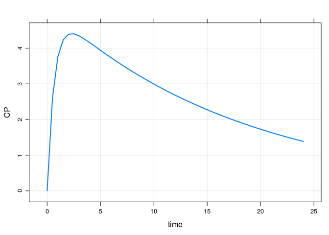

IPRED
================

``` r
.libPaths("/data/Rlibs")
library(mrgsolve)
library(tidyverse)
```

    ## ── Attaching packages ──────────────────────────────────────────────────────────────────────────────── tidyverse 1.2.1 ──

    ## ✔ ggplot2 3.1.1       ✔ purrr   0.3.2  
    ## ✔ tibble  2.1.1       ✔ dplyr   0.8.0.1
    ## ✔ tidyr   0.8.3       ✔ stringr 1.4.0  
    ## ✔ readr   1.3.1       ✔ forcats 0.4.0

    ## ── Conflicts ─────────────────────────────────────────────────────────────────────────────────── tidyverse_conflicts() ──
    ## ✖ dplyr::filter() masks stats::filter()
    ## ✖ dplyr::lag()    masks stats::lag()

Simulate the data with mrgsolve
===============================

There are no random effects in this model (RUV, IIV)

``` r
mod <- modlib("pk1") %>% param(CL = 1.1, V = 20, KA = 1.5) 
```

    ## Building pk1 ... done.

``` r
out <- mrgsim(mod, events = ev(amt = 100), carry_out = "amt,ii,addl,evid,cmt", delta = 0.5, recsort = 3)


plot(out, CP ~ time)
```



Write out a data set for NONMEM
===============================

``` r
nm <- 
  out %>% 
  as_tibble() %>%
  mutate(C = '.') %>% 
  select(C,everything(), -EV, -CENT, -CP) %>% 
  mutate(DV  = '.', cmt = ifelse(evid==0,2,1))


head(nm)
```

    ## # A tibble: 6 x 9
    ##   C        ID  time  evid   amt   cmt    ii  addl DV   
    ##   <chr> <dbl> <dbl> <dbl> <dbl> <dbl> <dbl> <dbl> <chr>
    ## 1 .         1   0       1   100     1     0     0 .    
    ## 2 .         1   0       0     0     2     0     0 .    
    ## 3 .         1   0.5     0     0     2     0     0 .    
    ## 4 .         1   1       0     0     2     0     0 .    
    ## 5 .         1   1.5     0     0     2     0     0 .    
    ## 6 .         1   2       0     0     2     0     0 .

``` r
write_csv(nm, path = "1001.csv")
```

Simulate the data with NONMEM
=============================

Like the mrgsolve setup, no random effects (RUV or IIV)

``` r
metrumrg::NONR(1001, project = ".", 
               command = "/opt/NONMEM/nm74/nmqual/autolog.pl", 
               checkrunno=FALSE)
```

    ## Run 1001 complete.

    ## NONR complete.

``` r
tab <- read_table("1001/TAB", skip = 1) %>% as.data.frame
```

    ## Parsed with column specification:
    ## cols(
    ##   ID = col_double(),
    ##   TIME = col_double(),
    ##   IPRED = col_double(),
    ##   CP = col_double(),
    ##   DV = col_double(),
    ##   PRED = col_double()
    ## )

Check
-----

IPRED / PRED / A2/V are all the same

``` r
head(out)
```

    ##   ID time evid amt cmt ii addl         EV     CENT       CP
    ## 1  1  0.0    1 100   1  0    0 100.000000  0.00000 0.000000
    ## 2  1  0.0    0   0   0  0    0 100.000000  0.00000 0.000000
    ## 3  1  0.5    0   0   0  0    0  47.236655 51.95586 2.597793
    ## 4  1  1.0    0   0   0  0    0  22.313016 75.08875 3.754438
    ## 5  1  1.5    0   0   0  0    0  10.539922 84.64487 4.232243
    ## 6  1  2.0    0   0   0  0    0   4.978707 87.82496 4.391248

``` r
head(tab)
```

    ##   ID TIME  IPRED     CP     DV   PRED
    ## 1  1  0.0 0.0000 0.0000 0.0000 0.0000
    ## 2  1  0.0 0.0000 0.0000 0.0000 0.0000
    ## 3  1  0.5 2.5978 2.5978 2.5978 2.5978
    ## 4  1  1.0 3.7544 3.7544 3.7544 3.7544
    ## 5  1  1.5 4.2322 4.2322 4.2322 4.2322
    ## 6  1  2.0 4.3912 4.3912 4.3912 4.3912

``` r
summary(out$CP-tab[["IPRED"]])
```

    ##       Min.    1st Qu.     Median       Mean    3rd Qu.       Max. 
    ## -4.756e-05 -2.578e-05 -3.247e-06 -1.582e-06  2.008e-05  4.775e-05

Simulate from NONMEM with IIV
=============================

Just adding IIV

``` r
metrumrg::NONR(1002, project = ".", 
               command = "/opt/NONMEM/nm74/nmqual/autolog.pl", 
               checkrunno=FALSE)
```

    ## Run 1002 complete.

    ## NONR complete.

``` r
tab2 <- read_table("1002/TAB", skip = 1)
```

    ## Parsed with column specification:
    ## cols(
    ##   ID = col_double(),
    ##   TIME = col_double(),
    ##   IPRED = col_double(),
    ##   CP = col_double(),
    ##   DV = col_double(),
    ##   PRED = col_double()
    ## )

``` r
head(tab2)
```

    ## # A tibble: 6 x 6
    ##      ID  TIME IPRED    CP    DV  PRED
    ##   <dbl> <dbl> <dbl> <dbl> <dbl> <dbl>
    ## 1     1   0    0     0     0     0   
    ## 2     1   0    0     0     0     0   
    ## 3     1   0.5  4.86  4.86  4.86  2.60
    ## 4     1   1    6.25  6.25  6.25  3.75
    ## 5     1   1.5  6.64  6.64  6.64  4.23
    ## 6     1   2    6.74  6.74  6.74  4.39

Compare IIV with no IIV
=======================

``` r
head(tab)
```

    ##   ID TIME  IPRED     CP     DV   PRED
    ## 1  1  0.0 0.0000 0.0000 0.0000 0.0000
    ## 2  1  0.0 0.0000 0.0000 0.0000 0.0000
    ## 3  1  0.5 2.5978 2.5978 2.5978 2.5978
    ## 4  1  1.0 3.7544 3.7544 3.7544 3.7544
    ## 5  1  1.5 4.2322 4.2322 4.2322 4.2322
    ## 6  1  2.0 4.3912 4.3912 4.3912 4.3912

``` r
head(tab2)
```

    ## # A tibble: 6 x 6
    ##      ID  TIME IPRED    CP    DV  PRED
    ##   <dbl> <dbl> <dbl> <dbl> <dbl> <dbl>
    ## 1     1   0    0     0     0     0   
    ## 2     1   0    0     0     0     0   
    ## 3     1   0.5  4.86  4.86  4.86  2.60
    ## 4     1   1    6.25  6.25  6.25  3.75
    ## 5     1   1.5  6.64  6.64  6.64  4.23
    ## 6     1   2    6.74  6.74  6.74  4.39
