Tests with NONMEM
================
Metrum Research Group, LLC

-   [Functions](#functions)
    -   [Save `mrgsim` output as a `nonmem` input data set](#save-mrgsim-output-as-a-nonmem-input-data-set)
    -   [Save the `nonmem` input data set](#save-the-nonmem-input-data-set)
    -   [Run `nonmem`](#run-nonmem)
    -   [Read in `nonmem` simulation results](#read-in-nonmem-simulation-results)
    -   [Simulate a scenario with `mrsim`](#simulate-a-scenario-with-mrsim)
-   [The `mrgsim` model](#the-mrgsim-model)
-   [Scenarios](#scenarios)
    -   [Bolus doses, with additional](#bolus-doses-with-additional)
    -   [Bolus doses, lag time and bioav factor](#bolus-doses-lag-time-and-bioav-factor)
    -   [Infusion doses, with additional](#infusion-doses-with-additional)
    -   [Infusion doses to depot, with additional](#infusion-doses-to-depot-with-additional)
    -   [Infusion doses, with additional and lag time](#infusion-doses-with-additional-and-lag-time)
    -   [Infusion doses, with lag time and bioav factor](#infusion-doses-with-lag-time-and-bioav-factor)
    -   [Infusion doses at steady-state, with lag time and bioav factor](#infusion-doses-at-steady-state-with-lag-time-and-bioav-factor)
    -   [Infusion doses at steady state, II &lt; DUR, with bioav factor](#infusion-doses-at-steady-state-ii-dur-with-bioav-factor)
    -   [Infusion doses at steady state, II &lt; DUR, no bioav factor](#infusion-doses-at-steady-state-ii-dur-no-bioav-factor)
    -   [Infusion doses at steady state where II is a multiple of DUR](#infusion-doses-at-steady-state-where-ii-is-a-multiple-of-dur)
    -   [Infusion doses at steady state where II == DUR, with bioav factor](#infusion-doses-at-steady-state-where-ii-dur-with-bioav-factor)
    -   [Infusion doses at steady state, where II == DUR](#infusion-doses-at-steady-state-where-ii-dur)
    -   [Bolus doses at steady state, with bioav factor and lag time](#bolus-doses-at-steady-state-with-bioav-factor-and-lag-time)
    -   [Bolus doses with lag time and bioavability factor](#bolus-doses-with-lag-time-and-bioavability-factor)
    -   [Bolus / infusion](#bolus-infusion)
    -   [Infusion with modeled duration, lag time, and bioav factor](#infusion-with-modeled-duration-lag-time-and-bioav-factor)
    -   [Infusion with modeled duration, at steady state with bioav factor](#infusion-with-modeled-duration-at-steady-state-with-bioav-factor)
    -   [Reset and dose (EVID 4) with additional](#reset-and-dose-evid-4-with-additional)
    -   [Reset (EVID 3) with additional](#reset-evid-3-with-additional)
    -   [Steady state 1 and 2](#steady-state-1-and-2)
-   [Collect `mrgsim` output](#collect-mrgsim-output)
-   [Create a single data set for `nonmem`](#create-a-single-data-set-for-nonmem)
-   [Simulate with `nonmem`](#simulate-with-nonmem)
-   [Overall Summary](#overall-summary)
-   [Summary by RUN](#summary-by-run)
-   [Plot](#plot)
-   [Control stream](#control-stream)
-   [Session Info](#session-info)

\newpage
``` r
Sys.setenv(RSTUDIO_PANDOC = "/usr/lib/rstudio-server/bin/pandoc")
```

``` r
.libPaths("/data/Rlibs")
library(mrgsolve)
library(dplyr)
library(readr)
library(ggplot2)
```

``` r
carry <- c("cmt", "amt","ii", "addl", "rate", "evid", "ss")
```

Functions
=========

Save `mrgsim` output as a `nonmem` input data set
-------------------------------------------------

``` r
to_data_set <- function(x,id = NULL) {
  x <- as.data.frame(x)
  x <- mutate(x, C = '.', DV = '.', cmt = if_else(cmt==0, 2, cmt))
  x <- dplyr::select(x, "C", everything())
  if(is.numeric(id)) x <- mutate(x,ID = id)
  x
}
```

Save the `nonmem` input data set
--------------------------------

``` r
sv <- function(x,file) {
  write.csv(file = file, row.names = FALSE, quote = FALSE, x)
}
```

Run `nonmem`
------------

``` r
run <- function(number) {
  metrumrg::NONR(number, project = "model", 
                 command = "/opt/NONMEM/nm73/nmqual/autolog.pl", 
                 checkrunno=FALSE)
  return(tabread(number))
}
```

Read in `nonmem` simulation results
-----------------------------------

``` r
tabread <- function(number) {
  tab <- file.path("model", number, "TAB")
  if(file.exists(tab)) return(read_table(tab, skip=1))
  stop("the run failed")
}
```

Simulate a scenario with `mrsim`
--------------------------------

``` r
sim <- function(x, e,...) {
  mrgsim(x, events = e, carry.out = carry, digits = 5, ...) 
}
```

\newpage
The `mrgsim` model
==================

``` r
code <- '
$SET req = ""
$PARAM CL = 1.1, V = 20, KA = 1.5
LAGT = 0, MODE = 0, DUR2 = 2, RAT2 = 10, BIOAV = 1

$PKMODEL cmt = "GUT CENT", depot = TRUE

$MAIN

F_CENT = BIOAV;
ALAG_CENT = LAGT;

if(MODE==1) R_CENT = RAT2;
if(MODE==2) D_CENT = DUR2;


$TABLE
capture DV = (CENT/(V/1000));
capture CP = DV;

$CAPTURE LAGT MODE DUR2 RAT2 BIOAV
'

mod <- mcode_cache("tests1", code)
```

    . Compiling tests1 ... done.

``` r
mod <- update(mod, end=130, delta = 1)
```

\newpage
Scenarios
=========

### Bolus doses, with additional

``` r
ev <- ev(amt = 100, ii = 24, addl = 3) 
ev
```

    . Events:
    .   time cmt amt evid ii addl
    . 1    0   1 100    1 24    3

``` r
out1 <- sim(mod,ev)
```

    . 1
    . 0
    . 0
    . 1 24 -600
    . 1 48 -600
    . 1 72 -600
    . 1
    . 24
    . -600
    . 1
    . 48
    . -600
    . 1
    . 72
    . -600

``` r
plot(out1)
```

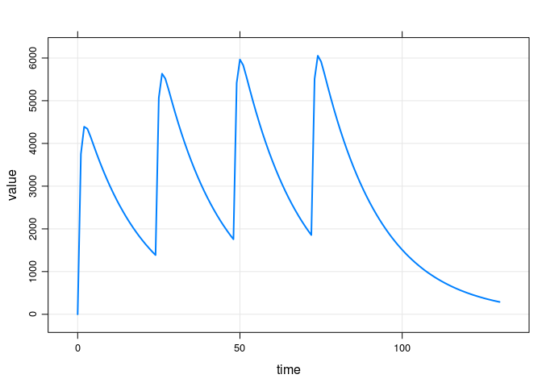

``` r
data1 <- to_data_set(out1, 1)
```

### Bolus doses, lag time and bioav factor

``` r
ev <- ev(amt = 100, ii = 24, addl = 3, LAGT = 12.13, BIOAV = 2.23, cmt = 2) 
ev
```

    . Events:
    .   time cmt amt evid ii addl  LAGT BIOAV
    . 1    0   2 100    1 24    3 12.13  2.23

``` r
out1.1 <- sim(mod,ev)
```

    . 2
    . 0
    . 0
    . 2 36.13 -600
    . 2 60.13 -600
    . 2 84.13 -600
    . 2
    . 12.13
    . -1200
    . 2
    . 36.13
    . -600
    . 2
    . 60.13
    . -600
    . 2
    . 84.13
    . -600

``` r
plot(out1.1)
```

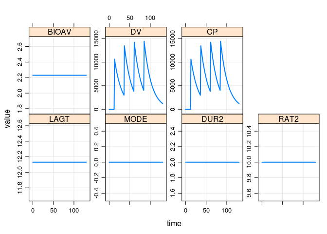

``` r
data1.1 <- to_data_set(out1.1, 1.1)
```

### Infusion doses, with additional

``` r
ev <- ev(amt = 100, ii = 24, addl = 3, rate = 100/10, cmt = 2) 
ev
```

    . Events:
    .   time cmt amt evid ii addl rate
    . 1    0   2 100    1 24    3   10

``` r
out2 <- sim(mod,ev)
```

    . 2
    . 0
    . 0
    . 2 24 -600
    . 2 48 -600
    . 2 72 -600
    . 2
    . 24
    . -600
    . 2
    . 48
    . -600
    . 2
    . 72
    . -600

``` r
plot(out2)
```

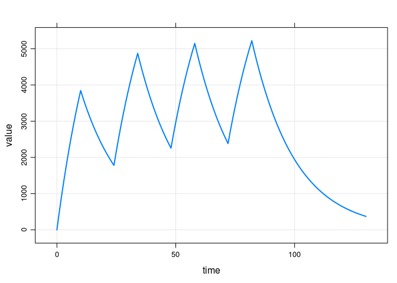

``` r
data2 <- to_data_set(out2, 2)
```

### Infusion doses to depot, with additional

``` r
ev <- ev(amt = 100, ii = 24, addl = 3, rate = 100/12, cmt = 1) 
ev
```

    . Events:
    .   time cmt amt evid ii addl     rate
    . 1    0   1 100    1 24    3 8.333333

``` r
out2.1 <- sim(mod,ev)
```

    . 1
    . 0
    . 0
    . 1 24 -600
    . 1 48 -600
    . 1 72 -600
    . 1
    . 24
    . -600
    . 1
    . 48
    . -600
    . 1
    . 72
    . -600

``` r
plot(out2.1)
```

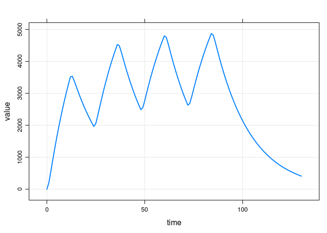

``` r
data2.1 <- to_data_set(out2.1, 2.1)
```

### Infusion doses, with additional and lag time

``` r
ev <- ev(amt = 100, ii = 24, addl=3, rate = 100/10, LAGT = 4.15, cmt = 2) 
ev
```

    . Events:
    .   time cmt amt evid ii addl rate LAGT
    . 1    0   2 100    1 24    3   10 4.15

``` r
out3 <- sim(mod,ev)
```

    . 2
    . 0
    . 0
    . 2 28.15 -600
    . 2 52.15 -600
    . 2 76.15 -600
    . 2
    . 4.15
    . -1200
    . 2
    . 28.15
    . -600
    . 2
    . 52.15
    . -600
    . 2
    . 76.15
    . -600

``` r
plot(out3)
```

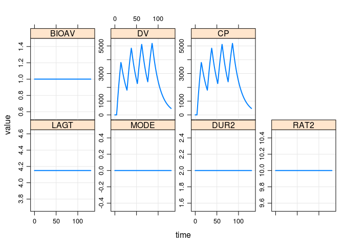

``` r
data3 <- to_data_set(out3, 3)
```

### Infusion doses, with lag time and bioav factor

``` r
ev <- ev(amt = 100, ii = 24, addl = 3, rate = 100/10, LAGT = 3.25, BIOAV = 0.412, cmt = 2) 
ev
```

    . Events:
    .   time cmt amt evid ii addl rate LAGT BIOAV
    . 1    0   2 100    1 24    3   10 3.25 0.412

``` r
out4 <- sim(mod,ev)
```

    . 2
    . 0
    . 0
    . 2 27.25 -600
    . 2 51.25 -600
    . 2 75.25 -600
    . 2
    . 3.25
    . -1200
    . 2
    . 27.25
    . -600
    . 2
    . 51.25
    . -600
    . 2
    . 75.25
    . -600

``` r
plot(out4)
```

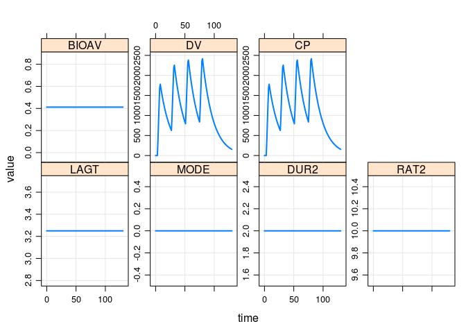

``` r
data4 <- to_data_set(out4, 4)
```

### Infusion doses at steady-state, with lag time and bioav factor

``` r
ev <- ev(amt = 100, ii = 24, addl = 3, rate = 100/10, LAGT = 3.16, BIOAV = 0.412, ss = 1, cmt = 2) 
ev
```

    . Events:
    .   time cmt amt evid ii addl rate LAGT BIOAV ss
    . 1    0   2 100    1 24    3   10 3.16 0.412  1

``` r
out5 <- sim(mod,ev)
```

    . 2
    . 0
    . 0
    . 2 27.16 -600
    . 2 51.16 -600
    . 2 75.16 -600
    . 2
    . 3.16
    . -1200
    . 2
    . 27.16
    . -600
    . 2
    . 51.16
    . -600
    . 2
    . 75.16
    . -600

``` r
plot(out5)
```

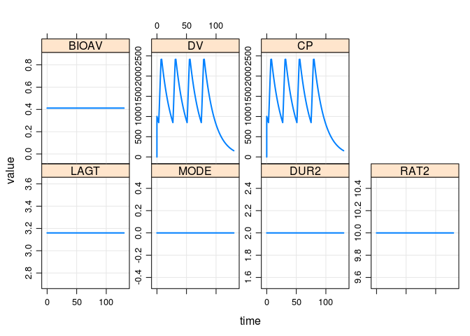

``` r
data5 <- to_data_set(out5, 5)
```

### Infusion doses at steady state, II &lt; DUR, with bioav factor

``` r
ev <- ev(amt = 100, ii = 6, addl = 12, rate = 100/10, BIOAV = 0.812, ss = 1, cmt = 2) 
ev
```

    . Events:
    .   time cmt amt evid ii addl rate BIOAV ss
    . 1    0   2 100    1  6   12   10 0.812  1

``` r
out6 <- sim(mod,ev)
```

    . 2
    . 0
    . 0
    . 2 6 -600
    . 2 12 -600
    . 2 18 -600
    . 2 24 -600
    . 2 30 -600
    . 2 36 -600
    . 2 42 -600
    . 2 48 -600
    . 2 54 -600
    . 2 60 -600
    . 2 66 -600
    . 2 72 -600
    . 2
    . 6
    . -600
    . 2
    . 12
    . -600
    . 2
    . 18
    . -600
    . 2
    . 24
    . -600
    . 2
    . 30
    . -600
    . 2
    . 36
    . -600
    . 2
    . 42
    . -600
    . 2
    . 48
    . -600
    . 2
    . 54
    . -600
    . 2
    . 60
    . -600
    . 2
    . 66
    . -600
    . 2
    . 72
    . -600

``` r
plot(out6)
```

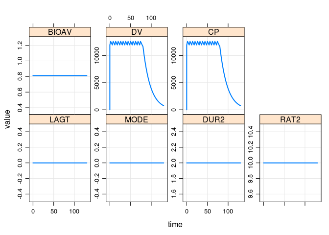

``` r
data6 <- to_data_set(out6, 6)
```

### Infusion doses at steady state, II &lt; DUR, no bioav factor

``` r
ev <- ev(amt = 100, ii = 6, addl = 12, rate = 100/10, ss = 1, cmt = 2) 
ev
```

    . Events:
    .   time cmt amt evid ii addl rate ss
    . 1    0   2 100    1  6   12   10  1

``` r
out6.1 <- sim(mod,ev)
```

    . 2
    . 0
    . 0
    . 2 6 -600
    . 2 12 -600
    . 2 18 -600
    . 2 24 -600
    . 2 30 -600
    . 2 36 -600
    . 2 42 -600
    . 2 48 -600
    . 2 54 -600
    . 2 60 -600
    . 2 66 -600
    . 2 72 -600
    . 2
    . 6
    . -600
    . 2
    . 12
    . -600
    . 2
    . 18
    . -600
    . 2
    . 24
    . -600
    . 2
    . 30
    . -600
    . 2
    . 36
    . -600
    . 2
    . 42
    . -600
    . 2
    . 48
    . -600
    . 2
    . 54
    . -600
    . 2
    . 60
    . -600
    . 2
    . 66
    . -600
    . 2
    . 72
    . -600

``` r
plot(out6.1)
```


``` r
data6.1 <- to_data_set(out6.1, 6.1)
```

### Infusion doses at steady state where II is a multiple of DUR

``` r
ev <- ev(amt = 100, ii = 6, addl = 12, rate = signif(100/12,5), ss = 1, cmt = 2) 
ev
```

    . Events:
    .   time cmt amt evid ii addl   rate ss
    . 1    0   2 100    1  6   12 8.3333  1

``` r
out6.2 <- sim(mod,ev)
```

    . 2
    . 0
    . 0
    . 2 6 -600
    . 2 12 -600
    . 2 18 -600
    . 2 24 -600
    . 2 30 -600
    . 2 36 -600
    . 2 42 -600
    . 2 48 -600
    . 2 54 -600
    . 2 60 -600
    . 2 66 -600
    . 2 72 -600
    . 2
    . 6
    . -600
    . 2
    . 12
    . -600
    . 2
    . 18
    . -600
    . 2
    . 24
    . -600
    . 2
    . 30
    . -600
    . 2
    . 36
    . -600
    . 2
    . 42
    . -600
    . 2
    . 48
    . -600
    . 2
    . 54
    . -600
    . 2
    . 60
    . -600
    . 2
    . 66
    . -600
    . 2
    . 72
    . -600

``` r
plot(out6.2)
```

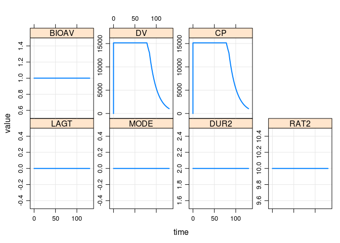

``` r
data6.2 <- to_data_set(out6.2, 6.2)
```

### Infusion doses at steady state where II == DUR, with bioav factor

``` r
ev <- ev(amt = 100, ii = 10, addl = 8, rate = 100/10, LAGT = 0, BIOAV = 0.412, ss = 1, cmt = 2) 
ev
```

    . Events:
    .   time cmt amt evid ii addl rate LAGT BIOAV ss
    . 1    0   2 100    1 10    8   10    0 0.412  1

``` r
out7 <- sim(mod,ev)
```

    . 2
    . 0
    . 0
    . 2 10 -600
    . 2 20 -600
    . 2 30 -600
    . 2 40 -600
    . 2 50 -600
    . 2 60 -600
    . 2 70 -600
    . 2 80 -600
    . 2
    . 10
    . -600
    . 2
    . 20
    . -600
    . 2
    . 30
    . -600
    . 2
    . 40
    . -600
    . 2
    . 50
    . -600
    . 2
    . 60
    . -600
    . 2
    . 70
    . -600
    . 2
    . 80
    . -600

``` r
plot(out7)
```

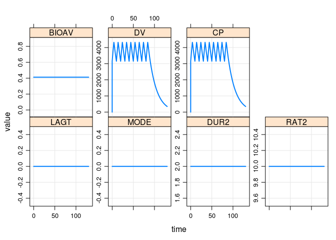

``` r
data7 <- to_data_set(out7, 7)
```

### Infusion doses at steady state, where II == DUR

``` r
ev <- ev(amt = 100, ii = 10, addl = 8, rate = 100/10, ss = 1, cmt = 2) 
ev
```

    . Events:
    .   time cmt amt evid ii addl rate ss
    . 1    0   2 100    1 10    8   10  1

``` r
out7.1 <- sim(mod,ev)
```

    . 2
    . 0
    . 0
    . 2 10 -600
    . 2 20 -600
    . 2 30 -600
    . 2 40 -600
    . 2 50 -600
    . 2 60 -600
    . 2 70 -600
    . 2 80 -600
    . 2
    . 10
    . -600
    . 2
    . 20
    . -600
    . 2
    . 30
    . -600
    . 2
    . 40
    . -600
    . 2
    . 50
    . -600
    . 2
    . 60
    . -600
    . 2
    . 70
    . -600
    . 2
    . 80
    . -600

``` r
plot(out7.1)
```

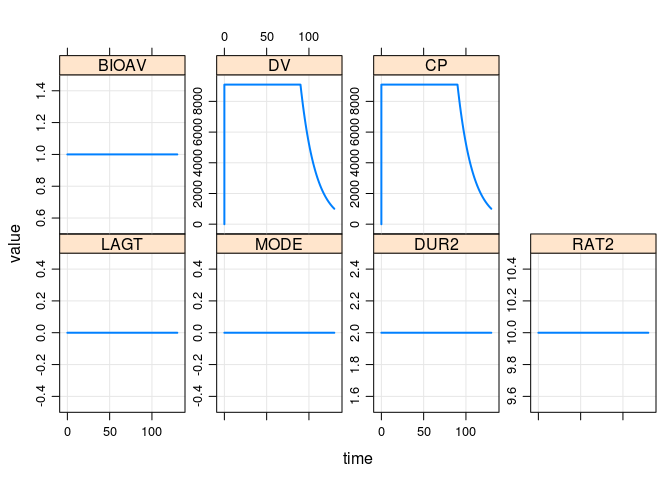

``` r
data7.1 <- to_data_set(out7.1, 7.1)
```

### Bolus doses at steady state, with bioav factor and lag time

``` r
ev <- ev(amt = 100, ii = 24, addl=3,  LAGT = 4, BIOAV = 0.412, ss = 1, cmt = 2) 
ev
```

    . Events:
    .   time cmt amt evid ii addl LAGT BIOAV ss
    . 1    0   2 100    1 24    3    4 0.412  1

``` r
out8 <- sim(mod,ev)
```

    . 2
    . 0
    . 0
    . 2 28 -600
    . 2 52 -600
    . 2 76 -600
    . 2
    . 4
    . -1200
    . 2
    . 28
    . -600
    . 2
    . 52
    . -600
    . 2
    . 76
    . -600

``` r
plot(out8)
```

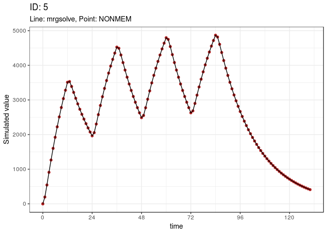

``` r
data8 <- to_data_set(out8, 8)
```

### Bolus doses with lag time and bioavability factor

``` r
ev <- ev(amt = 100, ii = 24, addl=3,  LAGT = 5, BIOAV = 0.412, cmt = 2) 
ev
```

    . Events:
    .   time cmt amt evid ii addl LAGT BIOAV
    . 1    0   2 100    1 24    3    5 0.412

``` r
out9 <- sim(mod,ev)
```

    . 2
    . 0
    . 0
    . 2 29 -600
    . 2 53 -600
    . 2 77 -600
    . 2
    . 5
    . -1200
    . 2
    . 29
    . -600
    . 2
    . 53
    . -600
    . 2
    . 77
    . -600

``` r
plot(out9)
```

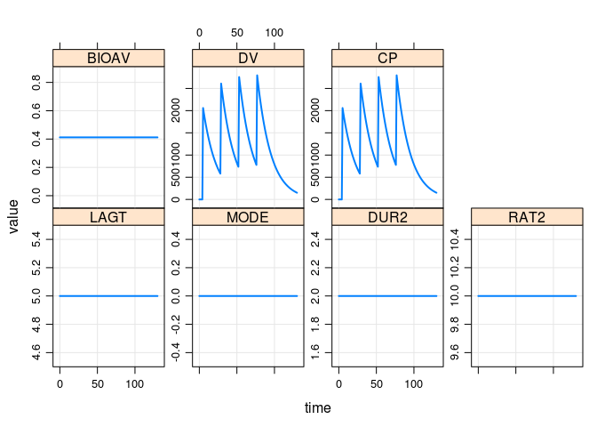

``` r
data9 <- to_data_set(out9, 9)
```

### Bolus / infusion

``` r
ev <- ev(amt = 100, cmt = 2, LAGT = 1) + ev(time = 13, amt = 50, ii = 24, addl = 2, rate = 24)
ev
```

    . Events:
    .   time cmt amt evid LAGT ii addl rate
    . 1    0   2 100    1    1  0    0    0
    . 2   13   1  50    1    0 24    2   24

``` r
out10 <- sim(mod,ev)
```

    . 2
    . 0
    . 0
    . 2
    . 1
    . -1200
    . 1
    . 13
    . 1
    . 1 37 -600
    . 1 61 -600
    . 1
    . 37
    . -600
    . 1
    . 61
    . -600

``` r
plot(out10)
```

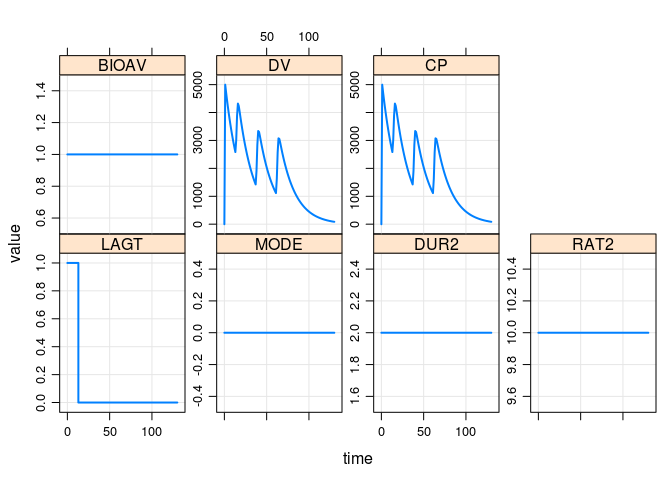

``` r
data10 <- to_data_set(out10, 10)
```

### Infusion with modeled duration, lag time, and bioav factor

``` r
ev <- ev(amt = 100, rate = -2, DUR2 = 9, MODE = 2, cmt = 2, ii = 24, addl = 3, LAGT = 5, BIOAV = 0.61)
ev
```

    . Events:
    .   time cmt amt evid rate DUR2 MODE ii addl LAGT BIOAV
    . 1    0   2 100    1   -2    9    2 24    3    5  0.61

``` r
out11 <- sim(mod,ev)
```

    . 2
    . 0
    . 0
    . 2 29 -600
    . 2 53 -600
    . 2 77 -600
    . 2
    . 5
    . -1200
    . 2
    . 29
    . -600
    . 2
    . 53
    . -600
    . 2
    . 77
    . -600

``` r
plot(out11)
```

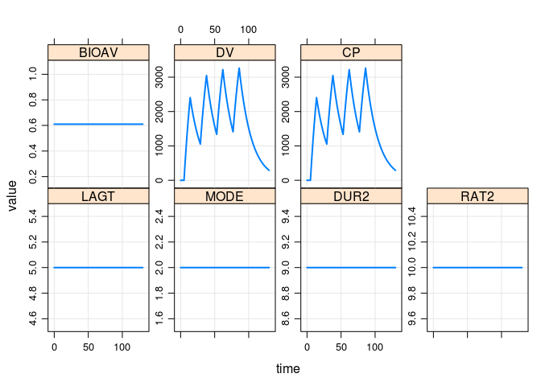

``` r
data11 <- to_data_set(out11,11)
```

### Infusion with modeled duration, at steady state with bioav factor

``` r
ev <- ev(amt = 100, rate = -2, DUR2 = 9, MODE = 2, cmt = 2, ii = 12, addl = 5, ss = 1, BIOAV = 0.61)
ev
```

    . Events:
    .   time cmt amt evid rate DUR2 MODE ii addl ss BIOAV
    . 1    0   2 100    1   -2    9    2 12    5  1  0.61

``` r
out12 <- sim(mod,ev)
```

    . 2
    . 0
    . 0
    . 2 12 -600
    . 2 24 -600
    . 2 36 -600
    . 2 48 -600
    . 2 60 -600
    . 2
    . 12
    . -600
    . 2
    . 24
    . -600
    . 2
    . 36
    . -600
    . 2
    . 48
    . -600
    . 2
    . 60
    . -600

``` r
plot(out12)
```

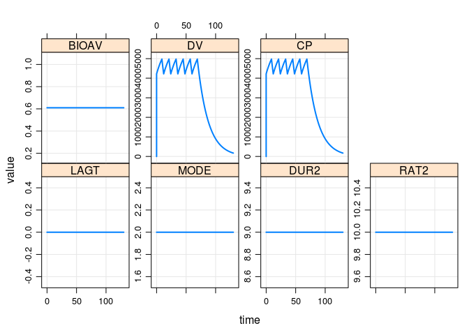

``` r
data12 <- to_data_set(out12,12)
```

### Reset and dose (EVID 4) with additional

``` r
ev <- 
  ev(amt = 100, ii = 12, addl = 5, rate = 50, BIOAV = 0.61) + 
  ev(amt = 120, evid = 4, time = 80, BIOAV = 0.5, ii = 12, addl = 2)
ev
```

    . Events:
    .   time cmt amt evid ii addl rate BIOAV
    . 1    0   1 100    1 12    5   50  0.61
    . 2   80   1 120    4 12    2    0  0.50

``` r
out13 <- sim(mod,ev)
```

    . 1
    . 0
    . 0
    . 1 12 -600
    . 1 24 -600
    . 1 36 -600
    . 1 48 -600
    . 1 60 -600
    . 1
    . 12
    . -600
    . 1
    . 24
    . -600
    . 1
    . 36
    . -600
    . 1
    . 48
    . -600
    . 1
    . 60
    . -600
    . 1 92 -600
    . 1 104 -600
    . 1
    . 92
    . -600
    . 1
    . 104
    . -600

``` r
plot(out13)
```

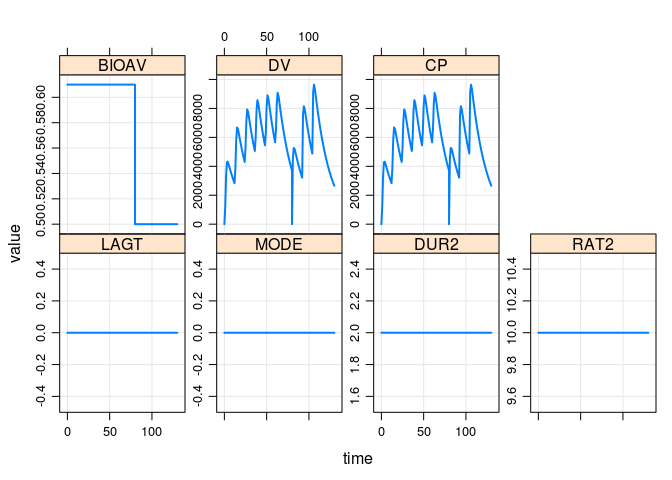

``` r
data13 <- to_data_set(out13,13)
```

### Reset (EVID 3) with additional

``` r
ev <- 
  ev(amt = 100, ii = 12, addl = 3, rate = 50, BIOAV = 0.61) + 
  ev(amt = 0, evid = 3, time = 50, cmt = 2) + 
  ev(amt = 120, ii = 24, addl = 2, time = 54)
ev
```

    . Events:
    .   time cmt amt evid ii addl rate BIOAV
    . 1    0   1 100    1 12    3   50  0.61
    . 2   50   2   0    3  0    0    0  0.00
    . 3   54   1 120    1 24    2    0  0.00

``` r
out14 <- sim(mod,ev)
```

    . 1
    . 0
    . 0
    . 1 12 -600
    . 1 24 -600
    . 1 36 -600
    . 1
    . 12
    . -600
    . 1
    . 24
    . -600
    . 1
    . 36
    . -600
    . 1
    . 54
    . 2
    . 1 78 -600
    . 1 102 -600
    . 1
    . 78
    . -600
    . 1
    . 102
    . -600

``` r
plot(out14)
```

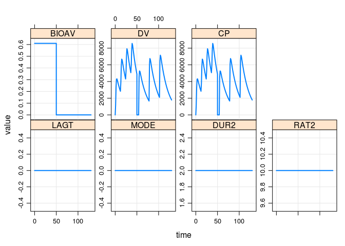

``` r
data14 <- to_data_set(out14,14)
```

### Steady state 1 and 2

``` r
ev <- 
  ev(amt = 100, ii = 24, addl = 3, ss = 1)  + 
  ev(amt = 50,  ii = 24, addl = 3, ss = 2, time = 12)
ev
```

    . Events:
    .   time cmt amt evid ii addl ss
    . 1    0   1 100    1 24    3  1
    . 2   12   1  50    1 24    3  2

``` r
out15 <- sim(mod,ev)
```

    . 1
    . 0
    . 0
    . 1 24 -600
    . 1 48 -600
    . 1 72 -600
    . 1
    . 12
    . 1
    . 1 36 -600
    . 1 60 -600
    . 1 84 -600
    . 1
    . 24
    . -600
    . 1
    . 36
    . -600
    . 1
    . 48
    . -600
    . 1
    . 60
    . -600
    . 1
    . 72
    . -600
    . 1
    . 84
    . -600

``` r
plot(out15)
```

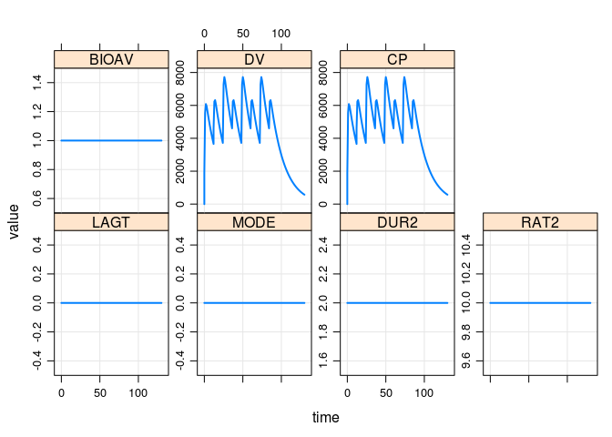

``` r
data15 <- to_data_set(out15,15)
```

Collect `mrgsim` output
=======================

``` r
sims <- list(out1,out1.1,out2,out2.1,out3,out4,out5,out6,out6.1,out6.2,out7,out7.1,
             out8,out9,out10,out11,out12,out13,out14,out15)
sims <- lapply(sims, as.data.frame)
sims <- bind_rows(sims)
```

Create a single data set for `nonmem`
=====================================

``` r
data <- bind_rows(data1,data1.1,data2,data2.1,data3,data4,data5,data6,data6.1,data6.2,data7,data7.1,
                  data8,data9,data10,data11,data12,data13,data14,data15)

sv(data, "data/1001.csv")
```

Simulate with `nonmem`
======================

``` r
out <- run(1001)
```

    . Run 1001 complete.

    . NONR complete.

    . Parsed with column specification:
    . cols(
    .   TIME = col_double(),
    .   EVID = col_double(),
    .   CP = col_double(),
    .   IPRED = col_double(),
    .   PRED = col_double(),
    .   DV = col_double()
    . )

Overall Summary
===============

Dimensions for mrgsim and nonmem output

``` r
dim(out)
```

    . [1] 2645    6

``` r
dim(sims)
```

    . [1] 2645   16

This is the `nonmem` minus `mrgsim` summary

``` r
summary(out$CP - sims$CP)
```

    .    Min. 1st Qu.  Median    Mean 3rd Qu.    Max. 
    .       0       0       0       0       0       0

``` r
data$NM <- out$CP
data$MRGSIM <- sims$CP
```

\newpage
Summary by RUN
==============

`diff` is the simulated `CP` from `nonmem` minus the simulated `CP` from `mrgsim`

``` r
group_by(data,ID) %>% 
  mutate(diff = NM - MRGSIM) %>%
  summarise(mean = mean(diff), max = max(diff), min = min(diff))
```

    . # A tibble: 20 x 4
    .       ID  mean   max   min
    .    <dbl> <dbl> <dbl> <dbl>
    .  1   1       0     0     0
    .  2   1.1     0     0     0
    .  3   2       0     0     0
    .  4   2.1     0     0     0
    .  5   3       0     0     0
    .  6   4       0     0     0
    .  7   5       0     0     0
    .  8   6       0     0     0
    .  9   6.1     0     0     0
    . 10   6.2     0     0     0
    . 11   7       0     0     0
    . 12   7.1     0     0     0
    . 13   8       0     0     0
    . 14   9       0     0     0
    . 15  10       0     0     0
    . 16  11       0     0     0
    . 17  12       0     0     0
    . 18  13       0     0     0
    . 19  14       0     0     0
    . 20  15       0     0     0

Plot
====

``` r
ggplot(data = data) + 
  geom_point(aes(time,NM),color = "firebrick") + 
  geom_line(aes(time,MRGSIM,group = ID)) +
  facet_wrap(~ID, scales = "free_y", ncol = 2) + 
  theme_bw()
```

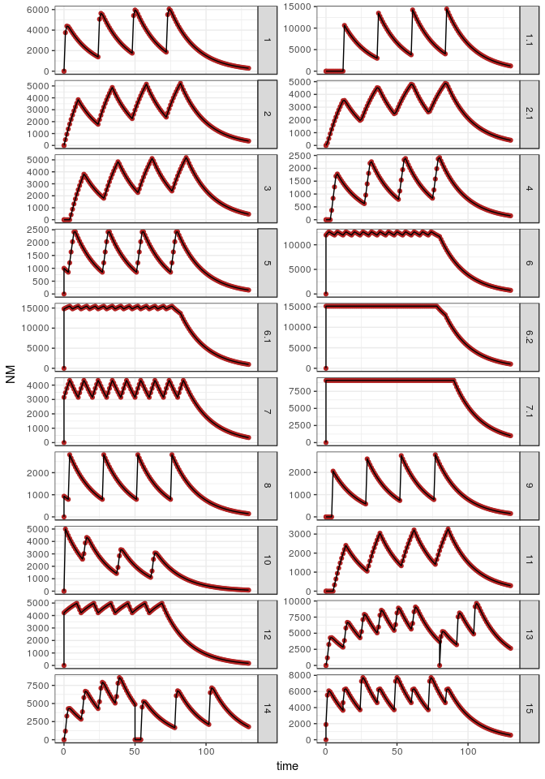

\newpage
Control stream
==============

``` r
writeLines(readLines("model/1001.ctl"))
```

       $PROB RUN# 101
       
       $INPUT C ID TIME EVID AMT CMT SS II ADDL RATE LAGT MODE DUR2 RAT2 BIOAV DV
       
       $DATA ../../data/1001.csv IGNORE=C
       
       $SUBROUTINES ADVAN2 TRANS2
       
       $PK
       
       TVCL=THETA(1)
       CL=TVCL*EXP(ETA(1))
       
       TVV2=THETA(2)
       V=TVV2*EXP(ETA(2))
       
       TVKA=THETA(3)
       KA=TVKA*EXP(ETA(3))
       
       ALAG2 = LAGT
       F2 = BIOAV
       
       IF(MODE.EQ.1) R2 = RAT2
       IF(MODE.EQ.2) D2 = DUR2
       
       $ERROR
       IPRED=A(2)/(V/1000)
       Y=IPRED*EXP(ERR(1))
       
       CP = IPRED
       
       $THETA
       (1.1,   FIX) ;; CL
       (20,  FIX) ;; V
       (1.5, FIX) ;; KA
       
       $OMEGA
       0.0 FIX
       0.0 FIX
       0.0 FIX
       
       $SIGMA
       0.00 FIX
       
       $TABLE FILE=TAB TIME EVID CP IPRED PRED DV NOPRINT ONEHEADER NOAPPEND
       
       $SIMULATION (2674474) ONLYSIMULATION

\newpage
Session Info
============

``` r
devtools::session_info()
```

    . Session info -------------------------------------------------------------

    .  setting  value                       
    .  version  R version 3.3.3 (2017-03-06)
    .  system   x86_64, linux-gnu           
    .  ui       X11                         
    .  language (EN)                        
    .  collate  en_US.UTF-8                 
    .  tz       Etc/UTC                     
    .  date     2018-10-12

    . Packages -----------------------------------------------------------------

    .  package       * version     date      
    .  assertthat      0.2.0       2017-04-11
    .  backports       1.1.2       2017-12-13
    .  base          * 3.3.3       2017-03-06
    .  bindr           0.1.1       2018-03-13
    .  bindrcpp      * 0.2.2       2018-03-29
    .  cli             1.0.0       2017-11-05
    .  colorspace      1.3-2       2016-12-14
    .  crayon          1.3.4       2017-09-16
    .  datasets      * 3.3.3       2017-03-06
    .  devtools        1.13.6      2018-06-27
    .  digest          0.6.15      2018-01-28
    .  dplyr         * 0.7.6       2018-06-29
    .  evaluate        0.10.1      2017-06-24
    .  fansi           0.3.0       2018-08-13
    .  ggplot2       * 3.0.0       2018-07-03
    .  glue            1.3.0       2018-07-17
    .  graphics      * 3.3.3       2017-03-06
    .  grDevices     * 3.3.3       2017-03-06
    .  grid            3.3.3       2017-03-06
    .  gtable          0.2.0       2016-02-26
    .  hms             0.4.2       2018-03-10
    .  htmltools       0.3.6       2017-04-28
    .  knitr           1.20        2018-02-20
    .  labeling        0.3         2014-08-23
    .  lattice         0.20-34     2016-09-06
    .  lazyeval        0.2.1       2017-10-29
    .  magrittr        1.5         2014-11-22
    .  MASS            7.3-50      2018-04-30
    .  memoise         1.0.0       2016-01-29
    .  methods       * 3.3.3       2017-03-06
    .  metrumrg        5.57        2017-10-14
    .  mrgsolve      * 0.8.12.9000 2018-09-21
    .  munsell         0.5.0       2018-06-12
    .  pillar          1.3.0       2018-07-14
    .  pkgconfig       2.0.2       2018-08-16
    .  plyr            1.8.4       2016-06-08
    .  purrr           0.2.5       2018-05-29
    .  R6              2.2.2       2017-06-17
    .  Rcpp            0.12.18     2018-07-23
    .  RcppArmadillo   0.9.100.5.0 2018-08-16
    .  readr         * 1.1.1       2017-05-16
    .  reshape         0.8.7       2017-08-06
    .  rlang           0.2.2       2018-08-16
    .  rmarkdown       1.10        2018-06-11
    .  rprojroot       1.3-2       2018-01-03
    .  scales          0.5.0.9000  2018-06-20
    .  stats         * 3.3.3       2017-03-06
    .  stringi         1.2.3       2018-06-12
    .  stringr         1.3.1       2018-05-10
    .  tibble          1.4.2       2018-01-22
    .  tidyselect      0.2.4       2018-02-26
    .  tools           3.3.3       2017-03-06
    .  utf8            1.1.4       2018-05-24
    .  utils         * 3.3.3       2017-03-06
    .  withr           2.1.2       2018-03-15
    .  XML             3.98-1.11   2018-04-16
    .  yaml            2.1.19      2018-05-01
    .  source                                       
    .  CRAN (R 3.3.3)                               
    .  cran (@1.1.2)                                
    .  local                                        
    .  CRAN (R 3.3.3)                               
    .  CRAN (R 3.3.3)                               
    .  cran (@1.0.0)                                
    .  CRAN (R 3.3.2)                               
    .  cran (@1.3.4)                                
    .  local                                        
    .  CRAN (R 3.3.3)                               
    .  cran (@0.6.15)                               
    .  CRAN (R 3.3.3)                               
    .  cran (@0.10.1)                               
    .  CRAN (R 3.3.3)                               
    .  CRAN (R 3.3.3)                               
    .  CRAN (R 3.3.3)                               
    .  local                                        
    .  local                                        
    .  local                                        
    .  CRAN (R 3.3.2)                               
    .  CRAN (R 3.3.3)                               
    .  cran (@0.3.6)                                
    .  CRAN (R 3.3.3)                               
    .  CRAN (R 3.3.2)                               
    .  CRAN (R 3.3.2)                               
    .  CRAN (R 3.3.3)                               
    .  CRAN (R 3.3.2)                               
    .  CRAN (R 3.3.3)                               
    .  CRAN (R 3.3.2)                               
    .  local                                        
    .  Github (metrumresearchgroup/metrumrg@2e5a541)
    .  local                                        
    .  cran (@0.5.0)                                
    .  CRAN (R 3.3.3)                               
    .  CRAN (R 3.3.3)                               
    .  CRAN (R 3.3.2)                               
    .  CRAN (R 3.3.3)                               
    .  cran (@2.2.2)                                
    .  CRAN (R 3.3.3)                               
    .  CRAN (R 3.3.3)                               
    .  CRAN (R 3.3.3)                               
    .  CRAN (R 3.3.3)                               
    .  CRAN (R 3.3.3)                               
    .  CRAN (R 3.3.3)                               
    .  cran (@1.3-2)                                
    .  Github (hadley/scales@80fe94c)               
    .  local                                        
    .  CRAN (R 3.3.3)                               
    .  CRAN (R 3.3.3)                               
    .  cran (@1.4.2)                                
    .  CRAN (R 3.3.3)                               
    .  local                                        
    .  CRAN (R 3.3.3)                               
    .  local                                        
    .  CRAN (R 3.3.3)                               
    .  CRAN (R 3.3.3)                               
    .  CRAN (R 3.3.3)
