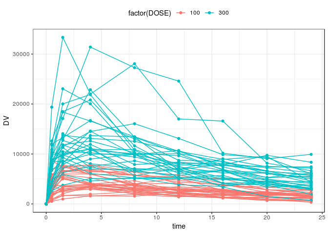
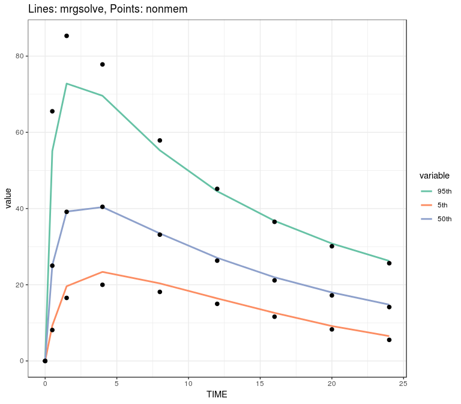
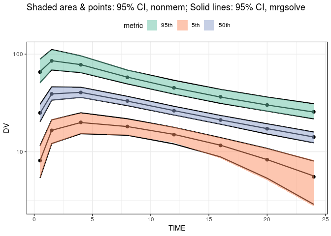

Predictive check with mrgsolve and NONMEM
================
Metrum Research Group, LLC

-   [Helper functions](#helper-functions)
    -   [Run `nonmem`](#run-nonmem)
    -   [Read in `nonmem` simulation results](#read-in-nonmem-simulation-results)
-   [Generate a template data set](#generate-a-template-data-set)
    -   [The `mrgsolve` model](#the-mrgsolve-model)
    -   [Sampling times](#sampling-times)
-   [Simulate](#simulate)
    -   [With NONMEM](#with-nonmem)
    -   [With mrgsolve](#with-mrgsolve)
-   [Summarize](#summarize)
    -   [The NONMEM data](#the-nonmem-data)
    -   [The mrgsolve data](#the-mrgsolve-data)
-   [Plot 1](#plot-1)
-   [Plot 2](#plot-2)
    -   [The NONMEM data](#the-nonmem-data-1)
    -   [The mrgsolve data](#the-mrgsolve-data-1)
-   [Models](#models)
    -   [NONMEM (104.ctl)](#nonmem-104.ctl)
    -   [mrgsolve](#mrgsolve)
-   [Environment](#environment)

``` r
.libPaths("/data/Rlibs")
library(mrgsolve)
library(dplyr)
library(readr)
library(tidyr)
library(ggplot2)
theme_set(theme_bw())
library(data.table)
```

Helper functions
================

Run `nonmem`
------------

``` r
run <- function(number) {
  metrumrg::NONR(number, project = "model", 
                 command = "/opt/NONMEM/nm73/nmqual/autolog.pl", 
                 checkrunno=FALSE)
  return(tabread(number))
}
```

Read in `nonmem` simulation results
-----------------------------------

``` r
tabread <- function(number) {
  tab <- file.path("model", number, "TAB")
  if(file.exists(tab)) return(fread(tab, skip=1))
  stop("the run failed")
}
```

Generate a template data set
============================

``` r
e1 <- ev(amt = 100)  %>% ev_rep(ID = 1:30)
e2 <- ev(amt = 300)  %>% ev_rep(ID = 1:30)
data <- as_data_set(e1,e2)

set.seed(11010)
data <- mutate(data, WT = runif(n(), 50,95), DOSE = amt)

head(data)
```

    .   ID time cmt evid amt       WT DOSE
    . 1  1    0   1    1 100 82.32126  100
    . 2  2    0   1    1 100 79.73973  100
    . 3  3    0   1    1 100 77.86378  100
    . 4  4    0   1    1 100 93.82175  100
    . 5  5    0   1    1 100 78.86220  100
    . 6  6    0   1    1 100 88.80683  100

``` r
count(data,DOSE)
```

    . # A tibble: 2 x 2
    .    DOSE     n
    .   <dbl> <int>
    . 1   100    30
    . 2   300    30

The `mrgsolve` model
--------------------

We'll use this to both simulate the predcheck for mrgsolve as well as to generate the data template

``` r
code <- '
$SET req = ""

$PARAM WT = 70, DOSE = 1

$PKMODEL cmt = "GUT CENT", depot = TRUE

$THETA
1 
20 
1.5

$OMEGA
0.09 
0.2 
0.5

$SIGMA 
0.02

$MAIN
double TVCL = THETA1*pow(WT/70,0.75);
double CL = TVCL*exp(ETA(1));

double TVV = THETA2*(WT/70);
double V  = TVV*exp(ETA(2));

double TVKA = THETA3;
double KA = TVKA*exp(ETA(3));

$TABLE
capture DV = (CENT/(V/1000))*exp(EPS(1));
capture CP = DV;
'

mod <- mcode_cache("tests5", code)
```

    . Compiling tests5 ... done.

Sampling times
--------------

``` r
tg <- tgrid(0,24,4,add = c(0.5,1.5))

out <- mrgsim_d(
  mod, data, tgrid = tg, 
  carry.out = "WT,DOSE,evid,amt,cmt,time", Req = "DV"
) %>% as_data_frame()
```

Just one sample data set

``` r
head(out)
```

    . # A tibble: 6 x 8
    .      ID  time  evid   amt   cmt    WT  DOSE    DV
    .   <dbl> <dbl> <dbl> <dbl> <dbl> <dbl> <dbl> <dbl>
    . 1     1   0       0     0     0  82.3   100    0 
    . 2     1   0       1   100     1  82.3   100    0 
    . 3     1   0.5     0     0     0  82.3   100 8649.
    . 4     1   1.5     0     0     0  82.3   100 7445.
    . 5     1   4       0     0     0  82.3   100 5993.
    . 6     1   8       0     0     0  82.3   100 3758.

``` r
ggplot(out, aes(time,DV,col = factor(DOSE),group = ID)) + 
  geom_point() + geom_line() + theme(legend.position = "top")
```



Write this out to file

``` r
temp <- 
  out %>% 
  mutate(C=NA_character_,DV=NA_character_) %>% 
  select(C,everything())

write.csv(file = "data/104.csv", temp, quote = FALSE, row.names=FALSE, na = '.')
```

Simulate
========

With NONMEM
-----------

``` r
foo <- run(104) %>% rename(IREP = V1, ID = V2, TIME = V3, EVID = V4, CP = V5, IPRED = V6, 
                           PRED = V7, DV = V8, DOSE = V9)
```

    . Run 104 complete.

    . NONR complete.

``` r
head(foo)
```

    .    IREP ID TIME EVID     CP  IPRED   PRED     DV DOSE
    . 1:    1  1  0.0    1    0.0    0.0    0.0    0.0  100
    . 2:    1  1  0.5    0 1904.2 1904.2 2213.3 1609.2  100
    . 3:    1  1  1.5    0 3596.8 3596.8 3624.1 3709.5  100
    . 4:    1  1  4.0    0 3985.3 3985.3 3613.8 4579.1  100
    . 5:    1  1  8.0    0 3218.5 3218.5 2991.3 2851.0  100
    . 6:    1  1 12.0    0 2545.2 2545.2 2468.6 2773.7  100

With mrgsolve
-------------

1000 replicates

``` r
out <- parallel::mclapply(1:1000, function(i) {
  mod %>% mrgsim_d(temp,carry.out = "DOSE") %>% mutate(IREP = i,TIME = time)
}) %>% bind_rows()

head(out)
```

    . # A tibble: 6 x 7
    .      ID  time  DOSE    DV    CP  IREP  TIME
    .   <dbl> <dbl> <dbl> <dbl> <dbl> <int> <dbl>
    . 1     1   0     100    0     0      1   0  
    . 2     1   0     100    0     0      1   0  
    . 3     1   0.5   100 4383. 4383.     1   0.5
    . 4     1   1.5   100 3909. 3909.     1   1.5
    . 5     1   4     100 2610. 2610.     1   4  
    . 6     1   8     100 3132. 3132.     1   8

Summarize
=========

-   Dose-normalize the concentrations (`DVN`)
-   Take the 5th, 50th, and 95th percentiles
-   Then take the median of the 5/50/95th percentiles

The NONMEM data
---------------

``` r
sum_nm <- 
  foo %>% 
  mutate(DVN = DV/DOSE) %>%
  group_by(IREP,TIME) %>% 
  summarise(med = median(DVN), lo = quantile(DVN,0.05), hi = quantile(DVN,0.95)) %>% 
  group_by(TIME) %>% summarise_at(vars(lo,med,hi),funs(median)) %>% ungroup
```

The mrgsolve data
-----------------

``` r
sum_mrg <- 
  out %>%
  mutate(DVN = DV/DOSE) %>%
  group_by(IREP,TIME) %>%
  summarise(med = median(DVN), lo = quantile(DVN,0.05), hi = quantile(DVN,0.95)) %>%
  group_by(TIME) %>% summarise_at(vars(lo,med,hi),funs(median)) %>% ungroup
```

Plot 1
======

Were are plotting the median 5th/50th/95th percentiles of the simulated data for both mrgsolve and nonmem

``` r
mrg <- sum_mrg %>% tidyr::gather(variable,value,lo:hi) %>% mutate(tool = "mrg")
non <- sum_nm %>%  tidyr::gather(variable,value,lo:hi) %>% mutate(tool = "nonmem")
```

``` r
ggplot() + ggtitle("Lines: mrgsolve, Points: nonmem") + 
  geom_line(data = mrg, aes(TIME, value, col = variable, group = variable), lwd = 1) +
  geom_point(data = non, aes(TIME,value),col = "black", size = 2) + 
  scale_color_brewer(palette = "Set2", labels = c("95th", "5th", "50th")) 
```



Plot 2
======

Look at 95% CI around the 5th/median/95th percentiles

The NONMEM data
---------------

``` r
nm_q <- 
  foo %>% 
  mutate(DVN = DV/DOSE) %>%
  group_by(IREP,TIME) %>%  
  summarise(med = median(DVN), lo = quantile(DVN,0.05), hi = quantile(DVN,0.95)) %>%
  ungroup() %>%
  gather(metric,value,med:hi) %>% 
  group_by(metric,TIME) %>% 
  summarise(med = median(value), lo = quantile(value,0.025), hi = quantile(value,0.975)) %>%
  filter(TIME > 0)
```

The mrgsolve data
-----------------

``` r
mrg_q <- 
  out %>%
  mutate(DVN = DV/DOSE) %>%
  group_by(IREP,TIME) %>%
  summarise(med = median(DVN), lo = quantile(DVN,0.05), hi = quantile(DVN,0.95)) %>%
  ungroup() %>%
  gather(metric,value,med:hi) %>% 
  group_by(metric,TIME) %>% 
  summarise(med = median(value), lo = quantile(value,0.025), hi = quantile(value,0.975)) %>%
  filter(TIME > 0)

mrg_q2 <- gather(mrg_q, q, value, med:hi)
nm_q2 <- gather(nm_q, q, value, med:hi)
```

Comparing 95% CI around 5th/50th/95th percentiles from mrgsolve (ribbon and points) and nonmem (lines)

``` r
ggplot() + 
  geom_point(data = nm_q, aes(TIME, med, group = metric), size = 2) +
  geom_line(data  = mrg_q2, aes(TIME, value, group = paste(metric,q)), lwd = 0.8) +
  geom_ribbon(data=nm_q, aes(TIME, ymin = lo, ymax = hi, group = metric, fill = metric), alpha = 0.5) +
  scale_y_continuous(trans = "log10", breaks = 10^seq(-4,4)) + 
  ylab("DV") + ggtitle("Shaded area & points: 95% CI, nonmem; Solid lines: 95% CI, mrgsolve") + 
  scale_fill_brewer(palette = "Set2", labels = c("95th", "5th" ,"50th")) + 
  theme(legend.position = "top")
```



Models
======

NONMEM (104.ctl)
----------------

``` r
cat(readLines("model/104.ctl"), sep="\n")
```

    . $PROB RUN# 104
    . 
    . $INPUT C ID TIME EVID AMT CMT WT DOSE DV
    . 
    . $DATA ../../data/104.csv IGNORE=C
    . 
    . $SUBROUTINES ADVAN2 TRANS2
    . 
    . $PK
    . 
    . TVCL=THETA(1)*(WT/70)**0.75
    . CL=TVCL*EXP(ETA(1))
    . 
    . TVV2=THETA(2)*(WT/70)
    . V=TVV2*EXP(ETA(2))
    . 
    . TVKA=THETA(3)
    . KA=TVKA*EXP(ETA(3))
    . 
    . 
    . $ERROR
    . IPRED=A(2)/(V/1000)
    . Y=IPRED*EXP(ERR(1))
    . 
    . CP = IPRED
    . 
    . REPI = IREP
    . 
    . $THETA
    . (1,   FIX) ;; CL
    . (20,  FIX) ;; V
    . (1.5, FIX) ;; KA
    . 
    . $OMEGA
    . 0.09 FIX
    . 0.2 FIX
    . 0.5 FIX
    . 
    . $SIGMA
    . 0.02 FIX
    . 
    . $TABLE FILE=TAB REPI ID TIME EVID CP IPRED PRED DV DOSE NOPRINT NOHEADER NOAPPEND
    . 
    . $SIMULATION (2674474) SUBPROBLEM = 1000 ONLYSIMULATION

mrgsolve
--------

``` r
cat(mod@code, sep = "\n")
```

    . 
    . $SET req = ""
    . 
    . $PARAM WT = 70, DOSE = 1
    . 
    . $PKMODEL cmt = "GUT CENT", depot = TRUE
    . 
    . $THETA
    . 1 
    . 20 
    . 1.5
    . 
    . $OMEGA
    . 0.09 
    . 0.2 
    . 0.5
    . 
    . $SIGMA 
    . 0.02
    . 
    . $MAIN
    . double TVCL = THETA1*pow(WT/70,0.75);
    . double CL = TVCL*exp(ETA(1));
    . 
    . double TVV = THETA2*(WT/70);
    . double V  = TVV*exp(ETA(2));
    . 
    . double TVKA = THETA3;
    . double KA = TVKA*exp(ETA(3));
    . 
    . $TABLE
    . capture DV = (CENT/(V/1000))*exp(EPS(1));
    . capture CP = DV;
    . 

Environment
===========

``` r
devtools::session_info()
```

    . Session info -------------------------------------------------------------

    .  setting  value                       
    .  version  R version 3.3.3 (2017-03-06)
    .  system   x86_64, linux-gnu           
    .  ui       X11                         
    .  language (EN)                        
    .  collate  en_US.UTF-8                 
    .  tz       Etc/UTC                     
    .  date     2018-06-23

    . Packages -----------------------------------------------------------------

    .  package       * version     date      
    .  assertthat      0.2.0       2017-04-11
    .  backports       1.1.2       2017-12-13
    .  base          * 3.3.3       2017-03-06
    .  bindr           0.1.1       2018-03-13
    .  bindrcpp      * 0.2.2       2018-03-29
    .  cli             1.0.0       2017-11-05
    .  colorspace      1.3-2       2016-12-14
    .  crayon          1.3.4       2017-09-16
    .  data.table    * 1.10.4-3    2017-10-27
    .  datasets      * 3.3.3       2017-03-06
    .  devtools        1.13.5      2018-02-18
    .  digest          0.6.15      2018-01-28
    .  dplyr         * 0.7.4       2017-09-28
    .  evaluate        0.10.1      2017-06-24
    .  ggplot2       * 2.2.1.9000  2018-06-20
    .  glue            1.2.0       2017-10-29
    .  graphics      * 3.3.3       2017-03-06
    .  grDevices     * 3.3.3       2017-03-06
    .  grid            3.3.3       2017-03-06
    .  gtable          0.2.0       2016-02-26
    .  hms             0.4.2       2018-03-10
    .  htmltools       0.3.6       2017-04-28
    .  knitr           1.20        2018-02-20
    .  labeling        0.3         2014-08-23
    .  lattice         0.20-34     2016-09-06
    .  lazyeval        0.2.1       2017-10-29
    .  magrittr        1.5         2014-11-22
    .  MASS            7.3-49      2018-02-23
    .  memoise         1.0.0       2016-01-29
    .  methods       * 3.3.3       2017-03-06
    .  metrumrg        5.57        2017-10-14
    .  mrgsolve      * 0.8.11      2018-04-26
    .  munsell         0.5.0       2018-06-12
    .  parallel        3.3.3       2017-03-06
    .  pillar          1.2.3       2018-05-25
    .  pkgconfig       2.0.1       2017-03-21
    .  plyr            1.8.4       2016-06-08
    .  purrr           0.2.4       2017-10-18
    .  R6              2.2.2       2017-06-17
    .  RColorBrewer    1.1-2       2014-12-07
    .  Rcpp            0.12.17     2018-05-18
    .  RcppArmadillo   0.8.400.0.0 2018-03-01
    .  readr         * 1.1.1       2017-05-16
    .  reshape         0.8.7       2017-08-06
    .  rlang           0.2.1       2018-05-30
    .  rmarkdown       1.9         2018-03-01
    .  rprojroot       1.3-2       2018-01-03
    .  scales          0.5.0.9000  2018-06-20
    .  stats         * 3.3.3       2017-03-06
    .  stringi         1.1.7       2018-03-12
    .  stringr         1.3.0       2018-02-19
    .  tibble          1.4.2       2018-01-22
    .  tidyr         * 0.8.0       2018-01-29
    .  tidyselect      0.2.4       2018-02-26
    .  tools           3.3.3       2017-03-06
    .  utf8            1.1.3       2018-01-03
    .  utils         * 3.3.3       2017-03-06
    .  withr           2.1.2       2018-03-15
    .  XML             3.98-1.11   2018-04-16
    .  yaml            2.1.18      2018-03-08
    .  source                                       
    .  CRAN (R 3.3.3)                               
    .  cran (@1.1.2)                                
    .  local                                        
    .  CRAN (R 3.3.3)                               
    .  CRAN (R 3.3.3)                               
    .  cran (@1.0.0)                                
    .  CRAN (R 3.3.2)                               
    .  cran (@1.3.4)                                
    .  CRAN (R 3.3.3)                               
    .  local                                        
    .  CRAN (R 3.3.3)                               
    .  cran (@0.6.15)                               
    .  CRAN (R 3.3.3)                               
    .  cran (@0.10.1)                               
    .  Github (tidyverse/ggplot2@1c09bae)           
    .  CRAN (R 3.3.3)                               
    .  local                                        
    .  local                                        
    .  local                                        
    .  CRAN (R 3.3.2)                               
    .  CRAN (R 3.3.3)                               
    .  cran (@0.3.6)                                
    .  CRAN (R 3.3.3)                               
    .  CRAN (R 3.3.2)                               
    .  CRAN (R 3.3.2)                               
    .  CRAN (R 3.3.3)                               
    .  CRAN (R 3.3.2)                               
    .  CRAN (R 3.3.3)                               
    .  CRAN (R 3.3.2)                               
    .  local                                        
    .  Github (metrumresearchgroup/metrumrg@2e5a541)
    .  local                                        
    .  cran (@0.5.0)                                
    .  local                                        
    .  CRAN (R 3.3.3)                               
    .  CRAN (R 3.3.3)                               
    .  CRAN (R 3.3.2)                               
    .  CRAN (R 3.3.3)                               
    .  cran (@2.2.2)                                
    .  CRAN (R 3.3.2)                               
    .  cran (@0.12.17)                              
    .  CRAN (R 3.3.3)                               
    .  CRAN (R 3.3.3)                               
    .  CRAN (R 3.3.3)                               
    .  cran (@0.2.1)                                
    .  CRAN (R 3.3.3)                               
    .  cran (@1.3-2)                                
    .  Github (hadley/scales@80fe94c)               
    .  local                                        
    .  CRAN (R 3.3.3)                               
    .  CRAN (R 3.3.3)                               
    .  cran (@1.4.2)                                
    .  CRAN (R 3.3.3)                               
    .  CRAN (R 3.3.3)                               
    .  local                                        
    .  cran (@1.1.3)                                
    .  local                                        
    .  CRAN (R 3.3.3)                               
    .  CRAN (R 3.3.3)                               
    .  CRAN (R 3.3.3)
