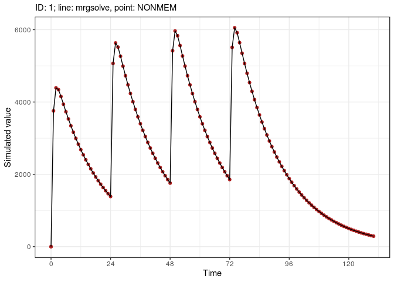
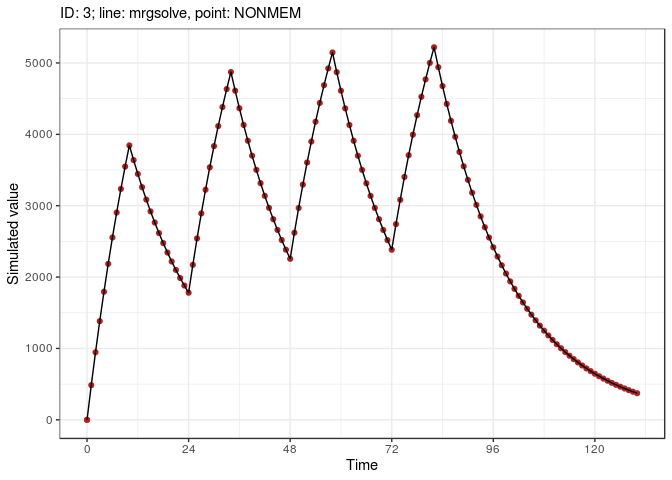
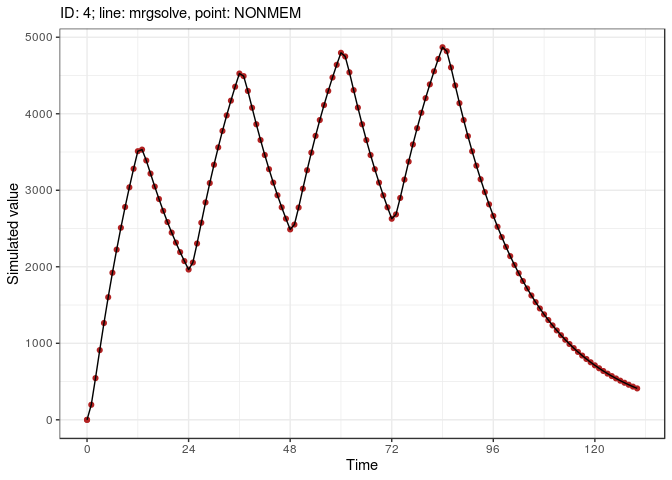

Bemchmark test with mrgsolve and NONMEM
================
Metrum Research Group

-   [Introduction](#introduction)
-   [Setup](#setup)
-   [Functions](#functions)
    -   [Save `mrgsim` output as a `nonmem` input data set](#save-mrgsim-output-as-a-nonmem-input-data-set)
    -   [Save the `nonmem` input data set](#save-the-nonmem-input-data-set)
    -   [Run `nonmem`](#run-nonmem)
    -   [Read in `nonmem` simulation results](#read-in-nonmem-simulation-results)
    -   [Simulate a scenario with `mrsim`](#simulate-a-scenario-with-mrsim)
-   [The `mrgsim` model](#the-mrgsim-model)
-   [Assemble the scenarios](#assemble-the-scenarios)
-   [Simulate with `nonmem`](#simulate-with-nonmem)
-   [Numeric Summary](#numeric-summary)
    -   [Overall](#overall)
    -   [Summary by scenario number](#summary-by-scenario-number)
-   [Results](#results)
    -   [1: Bolus with additional](#bolus-with-additional)
    -   [2: Bolus with lag time and bioav](#bolus-with-lag-time-and-bioav)
    -   [3: Infusion with additional](#infusion-with-additional)
    -   [4: Infusion doses to depot, with additional](#infusion-doses-to-depot-with-additional)
    -   [5: Infusion doses, with additional and lag time](#infusion-doses-with-additional-and-lag-time)
    -   [6: Infusion doses, with lag time and bioav factor](#infusion-doses-with-lag-time-and-bioav-factor)
    -   [7: Infusion doses, with lag time and bioav factor](#infusion-doses-with-lag-time-and-bioav-factor-1)
    -   [8: Infusion doses at steady-state, with lag time and bioav factor](#infusion-doses-at-steady-state-with-lag-time-and-bioav-factor)
    -   [9: Infusion doses, with lag time and bioav factor](#infusion-doses-with-lag-time-and-bioav-factor-2)
    -   [10: Infusion doses at steady state, II &lt; DUR, no bioav factor](#infusion-doses-at-steady-state-ii-dur-no-bioav-factor)
    -   [11: Infusion doses at steady state where II == DUR, with bioav factor](#infusion-doses-at-steady-state-where-ii-dur-with-bioav-factor)
    -   [12: Infusion doses at steady state, where II == DUR](#infusion-doses-at-steady-state-where-ii-dur)
    -   [13: Bolus doses at steady state, with bioav factor and lag time](#bolus-doses-at-steady-state-with-bioav-factor-and-lag-time)
    -   [14: Bolus doses with lag time and bioavability factor](#bolus-doses-with-lag-time-and-bioavability-factor)
    -   [15: Bolus then infusion](#bolus-then-infusion)
    -   [16: Infusion with modeled duration, lag time, and bioav factor](#infusion-with-modeled-duration-lag-time-and-bioav-factor)
    -   [17: Infusion with modeled duration, at steady state with bioav factor](#infusion-with-modeled-duration-at-steady-state-with-bioav-factor)
    -   [18: Reset and dose (EVID 4) with additional](#reset-and-dose-evid-4-with-additional)
    -   [19: Reset (EVID 3) with additional](#reset-evid-3-with-additional)
    -   [20: Steady state 1 and 2](#steady-state-1-and-2)
    -   [21: Steady state infusion](#steady-state-infusion)
-   [Control stream](#control-stream)
-   [Session Info](#session-info)

Introduction
============

This document runs simulations from a pharmacokinetic model using both NONMEM and mrgsolve and compares the results.

All of the relevant code is presented so that the user can trace how the simulations are performed. The complete source code can be viewed [here](nmtest7.R).

The bottom line results are presented in graphical form [here](#results) and numeric form [here](#numeric-summary).

Setup
=====

``` r
Sys.setenv(RSTUDIO_PANDOC = "/usr/lib/rstudio-server/bin/pandoc")
```

``` r
.libPaths("/data/Rlibs")
library(mrgsolve)
library(dplyr)
library(readr)
library(ggplot2)
library(parallel)
library(purrr)
library(tidyr)
```

``` r
carry <- c("cmt", "amt","ii", "addl", "rate", "evid", "ss")
```

Functions
=========

These functions assemble data sets, run simulations, and gather outputs. All scenarios are handled in exactly the same way.

Save `mrgsim` output as a `nonmem` input data set
-------------------------------------------------

``` r
to_data_set <- function(x,id=NULL) {
  x <- as.data.frame(x)
  x <- mutate(x, C = '.', DV = '.', cmt = if_else(cmt==0, 2, cmt))
  x <- dplyr::select(x, "C", everything())
  if(is.numeric(id)) x <- mutate(x,ID = id)
  x
}
```

Save the `nonmem` input data set
--------------------------------

``` r
sv <- function(x,file) {
  write.csv(file = file, row.names = FALSE, quote = FALSE, x)
}
```

Run `nonmem`
------------

``` r
run <- function(number) {
  metrumrg::NONR(number, project = "model", 
                 command = "/opt/NONMEM/nm74/nmqual/autolog.pl", 
                 checkrunno=FALSE)
  return(tabread(number))
}
```

Read in `nonmem` simulation results
-----------------------------------

``` r
tabread <- function(number) {
  tab <- file.path("model", number, "TAB")
  if(file.exists(tab)) return(read_table(tab, skip=1))
  stop("the run failed")
}
```

Simulate a scenario with `mrsim`
--------------------------------

``` r
sim <- function(x, e,...) {
  mrgsim(x, events = e, carry.out = carry, digits = 5, recsort=3, ...) 
}
```

The `mrgsim` model
==================

``` r
code <- '
$SET req = ""
$PARAM CL = 1.1, V = 20, KA = 1.5
LAGT = 0, MODE = 0, DUR2 = 2, RAT2 = 10, BIOAV = 1

$PKMODEL cmt = "GUT CENT", depot = TRUE

$MAIN

F_CENT = BIOAV;
ALAG_CENT = LAGT;

if(MODE==1) R_CENT = RAT2;
if(MODE==2) D_CENT = DUR2;


$TABLE
capture DV = (CENT/(V/1000));
capture CP = DV;

$CAPTURE LAGT MODE DUR2 RAT2 BIOAV
'

mod <- mcode_cache("tests1", code)
```

    . Building tests1 ... done.

``` r
mod <- update(mod, end=130, delta = 1)
```

Assemble the scenarios
======================

There is a lot of code here. See the [results](#results) section to see input data objects next to simulated data output from mrgsolve and NONMEM.

-   Doses into `cmt` 2 are intravascular and doses into `cmt` 1 are extravascular
-   `LAGT` sets the dosing lag time
-   `BIOAV` sets the bioavailability fraction

``` r
env <- new.env()
env$ev <- list()
env$descr <- list()
push_back <- function(env,ev,descr) {
  n <- length(env$ev)+1
  m <- length(env$descr)+1
  env$ev[[n]] <- ev
  env$descr[[m]] <- descr
}
```

``` r
ev <- ev(amt = 100, ii = 24, addl = 3) 
push_back(env,ev, "Bolus with additional")
```

``` r
ev <- ev(amt = 100, ii = 24, addl = 3, LAGT = 12.13, BIOAV = 2.23, cmt = 2) 
push_back(env, ev,"Bolus with lag time and bioav")
```

``` r
ev <- ev(amt = 100, ii = 24, addl = 3, rate = 100/10, cmt = 2) 
push_back(env,ev,"Infusion with additional")
```

``` r
ev <- ev(amt = 100, ii = 24, addl = 3, rate = 100/12, cmt = 1) 
push_back(env,ev,"Infusion doses to depot, with additional")
```

``` r
ev <- ev(amt = 100, ii = 24, addl=3, rate = 100/10, LAGT = 4.15, cmt = 2) 
push_back(env,ev,"Infusion doses, with additional and lag time")
```

``` r
ev <- ev(amt = 100, ii = 24, addl = 3, rate = 100/10, LAGT = 3.25, BIOAV = 0.412, cmt = 2) 
push_back(env,ev,"Infusion doses, with lag time and bioav factor")
```

``` r
ev <- ev(amt = 100, ii = 24, addl = 3, rate = 100/10, LAGT = 3.16, BIOAV = 0.412, ss = 1, cmt = 2) 
push_back(env,ev,"Infusion doses, with lag time and bioav factor")
```

``` r
ev <- ev(amt = 100, ii = 12, addl = 4, rate = 100/50, BIOAV = 0.812, ss = 1, cmt = 2) 
push_back(env,ev,"Infusion doses at steady-state, with lag time and bioav factor")
```

``` r
ev <- ev(amt = 100, ii = 12, addl = 3, rate = 100/50, ss = 1, cmt = 2) 
push_back(env,ev,"Infusion doses, with lag time and bioav factor")
```

``` r
ev <- ev(amt = 100, ii = 6, addl = 12, rate = signif(100/12,5), ss = 1, cmt = 2) 
push_back(env,ev,"Infusion doses at steady state, II < DUR, no bioav factor")
```

``` r
ev <- ev(amt = 100, ii = 10, addl = 8, rate = 0.412*100/10,  BIOAV = 0.412, ss = 1, cmt = 2) 
push_back(env,ev,"Infusion doses at steady state where II == DUR, with bioav factor")
```

``` r
ev <- ev(amt = 100, ii = 10, addl = 8, rate = 100/10, ss = 1, cmt = 2) 
push_back(env,ev,"Infusion doses at steady state, where II == DUR")
```

``` r
ev <- ev(amt = 100, ii = 24, addl = 3,  LAGT = 4, BIOAV = 0.412, ss = 1, cmt = 2) 
push_back(env,ev,"Bolus doses at steady state, with bioav factor and lag time")
```

``` r
ev <- ev(amt = 100, ii = 24, addl = 3,  LAGT = 5, BIOAV = 0.412, cmt = 2) 
push_back(env,ev,"Bolus doses with lag time and bioavability factor")
```

``` r
ev <- 
  ev(amt = 100, cmt = 2, LAGT = 1) + 
  ev(time = 13, amt = 50, ii = 24, addl = 2, rate = 24)
push_back(env,ev,"Bolus then infusion")
```

``` r
ev <- ev(amt = 100, rate = -2, DUR2 = 9, MODE = 2, cmt = 2, ii = 24, addl = 3, LAGT = 5, BIOAV = 0.61)
push_back(env,ev,"Infusion with modeled duration, lag time, and bioav factor")
```

``` r
ev <- ev(amt = 100, rate = -2, DUR2 = 9, MODE = 2, cmt = 2, ii = 24, addl = 3, ss = 1, BIOAV = 0.61)
push_back(env,ev,"Infusion with modeled duration, at steady state with bioav factor")
```

``` r
ev <- 
  ev(amt = 100, ii = 12, addl = 2, rate = 50, BIOAV = 0.61) + 
  ev(amt = 120, evid = 4, time = 50, BIOAV = 0.5, ii = 12, addl = 3)
push_back(env,ev,"Reset and dose (EVID 4) with additional")
```

``` r
ev <- 
  ev(amt = 100, ii = 12, addl = 3, rate = 50, BIOAV = 0.61) + 
  ev(amt = 0, evid = 3, time = 50, cmt = 2, BIOAV=1) + 
  ev(amt = 120, ii = 16, addl = 2, time = 54, BIOAV=1)
push_back(env,ev,"Reset (EVID 3) with additional")
```

``` r
ev <- 
  ev(amt = 100, ii = 24, addl = 3, ss = 1)  + 
  ev(amt = 50,  ii = 24, addl = 3, ss = 2, time = 12)
push_back(env,ev,"Steady state 1 and 2")
```

``` r
ev <- ev(amt = 0, rate = 100,  ss=1)
push_back(env,ev,"Steady state infusion")
```

``` r
update_id <- function(ev,id) mutate(ev, ID = id)

runs <- tibble(ev = env$ev, descr = env$descr)
runs <- mutate(runs, ID = seq(n()))
runs <- mutate(runs,ev = map2(ev,ID, update_id))
runs <- mutate(runs, sims = mclapply(ev, sim, x = mod))

runs <- mutate(runs, data = map(sims, to_data_set))
```

``` r
data <- runs[["data"]] %>% bind_rows()


sv(data, "data/1001.csv")
```

Simulate with `nonmem`
======================

``` r
out <- run(1001)
```

    . Run 1001 complete.

    . NONR complete.

    . Parsed with column specification:
    . cols(
    .   ID = col_double(),
    .   TIME = col_double(),
    .   CP = col_double()
    . )

Numeric Summary
===============

Look at the difference between simulated values from mrgsolve and NONMEM.

``` r
runs <- mutate(runs, out = split(out,out$ID))

runs <- mutate(
  runs, 
  comp = map2(out,sims, .f=function(out,sims) {
    tibble(
      ID = out$ID, 
      time = sims$time, 
      MRGSIM = sims$CP, 
      NONMEM = out$CP, 
      diff = MRGSIM-NONMEM)  
  })
)

comp <- runs %>% select(ID,comp) %>% unnest()
```

Overall
-------

This is the `nonmem` minus `mrgsim` summary

``` r
summary(comp$diff)
```

    .    Min. 1st Qu.  Median    Mean 3rd Qu.    Max. 
    .       0       0       0       0       0       0

Summary by scenario number
--------------------------

`diff` is the simulated `CP` from `nonmem` minus the simulated `CP` from `mrgsim`

``` r
group_by(comp,ID) %>% summarise(mean = mean(diff), max = max(diff), min = min(diff)) %>% 
  as.data.frame
```

    .    ID mean max min
    . 1   1    0   0   0
    . 2   2    0   0   0
    . 3   3    0   0   0
    . 4   4    0   0   0
    . 5   5    0   0   0
    . 6   6    0   0   0
    . 7   7    0   0   0
    . 8   8    0   0   0
    . 9   9    0   0   0
    . 10 10    0   0   0
    . 11 11    0   0   0
    . 12 12    0   0   0
    . 13 13    0   0   0
    . 14 14    0   0   0
    . 15 15    0   0   0
    . 16 16    0   0   0
    . 17 17    0   0   0
    . 18 18    0   0   0
    . 19 19    0   0   0
    . 20 20    0   0   0
    . 21 21    0   0   0

``` r
comp_plot <- function(comp) {
  id <- comp$ID[1]
  ggplot(data = comp) + 
    ggtitle(label=NULL,subtitle=paste0("ID: ", id, "; line: mrgsolve, point: NONMEM")) + 
    geom_point(aes(time,NONMEM),color = "firebrick") + 
    geom_line(aes(time,MRGSIM,group = ID)) +
    theme_bw() + ylab("Simulated value") + xlab("Time") + 
    scale_x_continuous(breaks = seq(0,130,24))  
}


runs <- mutate(runs, plot = map(comp, comp_plot))
```

Results
=======

1: Bolus with additional
------------------------

    . $ev
    . Events:
    .   ID time amt ii addl cmt evid
    . 1  1    0 100 24    3   1    1
    . 
    . $plot



2: Bolus with lag time and bioav
--------------------------------

    . $ev
    . Events:
    .   ID time amt ii addl cmt evid  LAGT BIOAV
    . 1  2    0 100 24    3   2    1 12.13  2.23
    . 
    . $plot


3: Infusion with additional
---------------------------

    . $ev
    . Events:
    .   ID time amt rate ii addl cmt evid
    . 1  3    0 100   10 24    3   2    1
    . 
    . $plot



4: Infusion doses to depot, with additional
-------------------------------------------

    . $ev
    . Events:
    .   ID time amt     rate ii addl cmt evid
    . 1  4    0 100 8.333333 24    3   1    1
    . 
    . $plot



5: Infusion doses, with additional and lag time
-----------------------------------------------

    . $ev
    . Events:
    .   ID time amt rate ii addl cmt evid LAGT
    . 1  5    0 100   10 24    3   2    1 4.15
    . 
    . $plot


6: Infusion doses, with lag time and bioav factor
-------------------------------------------------

    . $ev
    . Events:
    .   ID time amt rate ii addl cmt evid LAGT BIOAV
    . 1  6    0 100   10 24    3   2    1 3.25 0.412
    . 
    . $plot


7: Infusion doses, with lag time and bioav factor
-------------------------------------------------

    . $ev
    . Events:
    .   ID time amt rate ii addl cmt evid ss LAGT BIOAV
    . 1  7    0 100   10 24    3   2    1  1 3.16 0.412
    . 
    . $plot


8: Infusion doses at steady-state, with lag time and bioav factor
-----------------------------------------------------------------

    . $ev
    . Events:
    .   ID time amt rate ii addl cmt evid ss BIOAV
    . 1  8    0 100    2 12    4   2    1  1 0.812
    . 
    . $plot


9: Infusion doses, with lag time and bioav factor
-------------------------------------------------

    . $ev
    . Events:
    .   ID time amt rate ii addl cmt evid ss
    . 1  9    0 100    2 12    3   2    1  1
    . 
    . $plot


10: Infusion doses at steady state, II &lt; DUR, no bioav factor
----------------------------------------------------------------

    . $ev
    . Events:
    .   ID time amt   rate ii addl cmt evid ss
    . 1 10    0 100 8.3333  6   12   2    1  1
    . 
    . $plot


11: Infusion doses at steady state where II == DUR, with bioav factor
---------------------------------------------------------------------

    . $ev
    . Events:
    .   ID time amt rate ii addl cmt evid ss BIOAV
    . 1 11    0 100 4.12 10    8   2    1  1 0.412
    . 
    . $plot


12: Infusion doses at steady state, where II == DUR
---------------------------------------------------

    . $ev
    . Events:
    .   ID time amt rate ii addl cmt evid ss
    . 1 12    0 100   10 10    8   2    1  1
    . 
    . $plot


13: Bolus doses at steady state, with bioav factor and lag time
---------------------------------------------------------------

    . $ev
    . Events:
    .   ID time amt ii addl cmt evid ss LAGT BIOAV
    . 1 13    0 100 24    3   2    1  1    4 0.412
    . 
    . $plot


14: Bolus doses with lag time and bioavability factor
-----------------------------------------------------

    . $ev
    . Events:
    .   ID time amt ii addl cmt evid LAGT BIOAV
    . 1 14    0 100 24    3   2    1    5 0.412
    . 
    . $plot


15: Bolus then infusion
-----------------------

    . $ev
    . Events:
    .   ID time amt rate ii addl cmt evid LAGT
    . 1 15    0 100    0  0    0   2    1    1
    . 2 15   13  50   24 24    2   1    1    0
    . 
    . $plot


16: Infusion with modeled duration, lag time, and bioav factor
--------------------------------------------------------------

    . $ev
    . Events:
    .   ID time amt rate ii addl cmt evid DUR2 MODE LAGT BIOAV
    . 1 16    0 100   -2 24    3   2    1    9    2    5  0.61
    . 
    . $plot


17: Infusion with modeled duration, at steady state with bioav factor
---------------------------------------------------------------------

    . $ev
    . Events:
    .   ID time amt rate ii addl cmt evid ss DUR2 MODE BIOAV
    . 1 17    0 100   -2 24    3   2    1  1    9    2  0.61
    . 
    . $plot


18: Reset and dose (EVID 4) with additional
-------------------------------------------

    . $ev
    . Events:
    .   ID time amt rate ii addl cmt evid BIOAV
    . 1 18    0 100   50 12    2   1    1  0.61
    . 2 18   50 120    0 12    3   1    4  0.50
    . 
    . $plot


19: Reset (EVID 3) with additional
----------------------------------

    . $ev
    . Events:
    .   ID time amt rate ii addl cmt evid BIOAV
    . 1 19    0 100   50 12    3   1    1  0.61
    . 2 19   50   0    0  0    0   2    3  1.00
    . 3 19   54 120    0 16    2   1    1  1.00
    . 
    . $plot


20: Steady state 1 and 2
------------------------

    . $ev
    . Events:
    .   ID time amt ii addl cmt evid ss
    . 1 20    0 100 24    3   1    1  1
    . 2 20   12  50 24    3   1    1  2
    . 
    . $plot


21: Steady state infusion
-------------------------

    . $ev
    . Events:
    .   ID time amt rate cmt evid ss
    . 1 21    0   0  100   1    1  1
    . 
    . $plot


Control stream
==============

``` r
writeLines(readLines("model/1001/1001.lst"))
```

       Wed Oct  9 20:13:08 UTC 2019
       $PROB RUN# 101
       
       $INPUT C ID TIME EVID AMT CMT SS II ADDL RATE LAGT MODE DUR2 RAT2 BIOAV DV
       
       $DATA ../../data/1001.csv IGNORE=C
       
       $SUBROUTINES ADVAN2 TRANS2
       
       $PK
       
       TVCL=THETA(1)
       CL=TVCL*EXP(ETA(1))
       
       TVV2=THETA(2)
       V=TVV2*EXP(ETA(2))
       
       TVKA=THETA(3)
       KA=TVKA*EXP(ETA(3))
       
       ALAG2 = LAGT
       F2 = BIOAV
       
       IF(MODE.EQ.1) R2 = RAT2
       IF(MODE.EQ.2) D2 = DUR2
       
       $ERROR
       IPRED=A(2)/(V/1000)
       Y=IPRED*EXP(ERR(1))
       
       CP = IPRED
       
       $THETA
       (1.1,   FIX) ;; CL
       (20,  FIX) ;; V
       (1.5, FIX) ;; KA
       
       $OMEGA
       0.0 FIX
       0.0 FIX
       0.0 FIX
       
       $SIGMA
       0.00 FIX
       
       $TABLE FILE=TAB ID TIME CP NOPRINT ONEHEADER NOAPPEND
       
       $SIMULATION (2674474) ONLYSIMULATION
       
       
       NM-TRAN MESSAGES
         
        WARNINGS AND ERRORS (IF ANY) FOR PROBLEM    1
                    
        (WARNING  2) NM-TRAN INFERS THAT THE DATA ARE POPULATION.
       
       License Registered to: Metrum Research Group
       Expiration Date:    14 JUL 2020
       Current Date:        9 OCT 2019
       Days until program expires : 280
       1NONLINEAR MIXED EFFECTS MODEL PROGRAM (NONMEM) VERSION 7.4.3
        ORIGINALLY DEVELOPED BY STUART BEAL, LEWIS SHEINER, AND ALISON BOECKMANN
        CURRENT DEVELOPERS ARE ROBERT BAUER, ICON DEVELOPMENT SOLUTIONS,
        AND ALISON BOECKMANN. IMPLEMENTATION, EFFICIENCY, AND STANDARDIZATION
        PERFORMED BY NOUS INFOSYSTEMS.
       
        PROBLEM NO.:         1
        RUN# 101
       0DATA CHECKOUT RUN:              NO
        DATA SET LOCATED ON UNIT NO.:    2
        THIS UNIT TO BE REWOUND:        NO
        NO. OF DATA RECS IN DATA SET:     2777
        NO. OF DATA ITEMS IN DATA SET:  17
        ID DATA ITEM IS DATA ITEM NO.:   2
        DEP VARIABLE IS DATA ITEM NO.:  16
        MDV DATA ITEM IS DATA ITEM NO.: 17
       0INDICES PASSED TO SUBROUTINE PRED:
          4   3   5  10   7   8   6   0   0   0   9
       0LABELS FOR DATA ITEMS:
        C ID TIME EVID AMT CMT SS II ADDL RATE LAGT MODE DUR2 RAT2 BIOAV DV MDV
       0(NONBLANK) LABELS FOR PRED-DEFINED ITEMS:
        CP
       0FORMAT FOR DATA:
        (E2.0,E3.0,E4.0,E2.0,E4.0,2E2.0,2E3.0,E17.0,E6.0,2E2.0,3E6.0,1F2.0)
       
        TOT. NO. OF OBS RECS:     2751
        TOT. NO. OF INDIVIDUALS:       21
       0LENGTH OF THETA:   3
       0DEFAULT THETA BOUNDARY TEST OMITTED:    NO
       0OMEGA HAS SIMPLE DIAGONAL FORM WITH DIMENSION:   3
       0DEFAULT OMEGA BOUNDARY TEST OMITTED:    NO
       0SIGMA HAS SIMPLE DIAGONAL FORM WITH DIMENSION:   1
       0DEFAULT SIGMA BOUNDARY TEST OMITTED:    NO
       0INITIAL ESTIMATE OF THETA:
        LOWER BOUND    INITIAL EST    UPPER BOUND
         0.1100E+01     0.1100E+01     0.1100E+01
         0.2000E+02     0.2000E+02     0.2000E+02
         0.1500E+01     0.1500E+01     0.1500E+01
       0INITIAL ESTIMATE OF OMEGA:
        0.0000E+00
        0.0000E+00   0.0000E+00
        0.0000E+00   0.0000E+00   0.0000E+00
       0OMEGA CONSTRAINED TO BE THIS INITIAL ESTIMATE
       0INITIAL ESTIMATE OF SIGMA:
        0.0000E+00
       0SIGMA CONSTRAINED TO BE THIS INITIAL ESTIMATE
       0SIMULATION STEP OMITTED:    NO
        OBJ FUNC EVALUATED:         NO
        ORIGINAL DATA USED ON EACH NEW SIMULATION:         NO
        SEEDS RESET ON EACH NEW SUPERSET ITERATION:        YES
       0SIMULATION RANDOM METHOD SELECTED (RANMETHOD): 4U
       SEED   1 RESET TO INITIAL: YES
        SOURCE   1:
          SEED1:       2674474   SEED2:             0   PSEUDO-NORMAL
       0WARNING: NO. OF OBS RECS IN INDIVIDUAL REC NO.      1 (IN INDIVIDUAL
        REC ORDERING) EXCEEDS ONE WHILE INITIAL ESTIMATE OF WITHIN INDIVIDUAL VARIANCE IS ZERO
       0WARNING: NO. OF OBS RECS IN INDIVIDUAL REC NO.      2 (IN INDIVIDUAL
        REC ORDERING) EXCEEDS ONE WHILE INITIAL ESTIMATE OF WITHIN INDIVIDUAL VARIANCE IS ZERO
       0WARNING: NO. OF OBS RECS IN INDIVIDUAL REC NO.      3 (IN INDIVIDUAL
        REC ORDERING) EXCEEDS ONE WHILE INITIAL ESTIMATE OF WITHIN INDIVIDUAL VARIANCE IS ZERO
       0WARNING: NO. OF OBS RECS IN INDIVIDUAL REC NO.      4 (IN INDIVIDUAL
        REC ORDERING) EXCEEDS ONE WHILE INITIAL ESTIMATE OF WITHIN INDIVIDUAL VARIANCE IS ZERO
       0WARNING: NO. OF OBS RECS IN INDIVIDUAL REC NO.      5 (IN INDIVIDUAL
        REC ORDERING) EXCEEDS ONE WHILE INITIAL ESTIMATE OF WITHIN INDIVIDUAL VARIANCE IS ZERO
       0TABLES STEP OMITTED:    NO
        NO. OF TABLES:           1
        SEED NUMBER (SEED):    11456
        RANMETHOD:             3U
        MC SAMPLES (ESAMPLE):    300
        WRES SQUARE ROOT TYPE (WRESCHOL): EIGENVALUE
       0-- TABLE   1 --
       0RECORDS ONLY:    ALL
       04 COLUMNS APPENDED:    NO
        PRINTED:                NO
        HEADERS:               ONE
        FILE TO BE FORWARDED:   NO
        FORMAT:                S1PE11.4
        LFORMAT:
        RFORMAT:
        FIXED_EFFECT_ETAS:
       0USER-CHOSEN ITEMS:
        ID TIME CP
       1DOUBLE PRECISION PREDPP VERSION 7.4.3
       
        ONE COMPARTMENT MODEL WITH FIRST-ORDER ABSORPTION (ADVAN2)
       0MAXIMUM NO. OF BASIC PK PARAMETERS:   3
       0BASIC PK PARAMETERS (AFTER TRANSLATION):
          ELIMINATION RATE (K) IS BASIC PK PARAMETER NO.:  1
          ABSORPTION RATE (KA) IS BASIC PK PARAMETER NO.:  3
       
        TRANSLATOR WILL CONVERT PARAMETERS
        CLEARANCE (CL) AND VOLUME (V) TO K (TRANS2)
       0COMPARTMENT ATTRIBUTES
        COMPT. NO.   FUNCTION   INITIAL    ON/OFF      DOSE      DEFAULT    DEFAULT
                                STATUS     ALLOWED    ALLOWED    FOR DOSE   FOR OBS.
           1         DEPOT        OFF        YES        YES        YES        NO
           2         CENTRAL      ON         NO         YES        NO         YES
           3         OUTPUT       OFF        YES        NO         NO         NO
       1
        ADDITIONAL PK PARAMETERS - ASSIGNMENT OF ROWS IN GG
        COMPT. NO.                             INDICES
                     SCALE      BIOAVAIL.   ZERO-ORDER  ZERO-ORDER  ABSORB
                                FRACTION    RATE        DURATION    LAG
           1            *           *           *           *           *
           2            *           5           6           7           4
           3            *           -           -           -           -
                    - PARAMETER IS NOT ALLOWED FOR THIS MODEL
                    * PARAMETER IS NOT SUPPLIED BY PK SUBROUTINE;
                      WILL DEFAULT TO ONE IF APPLICABLE
       0DATA ITEM INDICES USED BY PRED ARE:
          EVENT ID DATA ITEM IS DATA ITEM NO.:      4
          TIME DATA ITEM IS DATA ITEM NO.:          3
          DOSE AMOUNT DATA ITEM IS DATA ITEM NO.:   5
          DOSE RATE DATA ITEM IS DATA ITEM NO.:    10
          STEADY STATE DATA ITEM IS DATA ITEM NO.:  7
          INTERVAL DATA ITEM IS DATA ITEM NO.:      8
          ADDL. DOSES DATA ITEM IS DATA ITEM NO.:   9
          COMPT. NO. DATA ITEM IS DATA ITEM NO.:    6
       
       0PK SUBROUTINE CALLED WITH EVERY EVENT RECORD.
        PK SUBROUTINE NOT CALLED AT NONEVENT (ADDITIONAL OR LAGGED) DOSE TIMES.
       0ERROR SUBROUTINE CALLED WITH EVERY EVENT RECORD.
       0ERROR SUBROUTINE INDICATES THAT DERIVATIVES OF COMPARTMENT AMOUNTS ARE USED.
       1
        SIMULATION STEP PERFORMED
        SOURCE  1:
           SEED1:    1222495484   SEED2:             0
        Elapsed simulation  time in seconds:     0.01
        ESTIMATION STEP OMITTED:                 YES
        Elapsed finaloutput time in seconds:     0.22
        #CPUT: Total CPU Time in Seconds,        0.238
       Stop Time:
       Wed Oct  9 20:13:12 UTC 2019

Session Info
============

``` r
options(width = 120)
devtools::session_info()
```

    . ─ Session info ───────────────────────────────────────────────────────────────────────────────────────────────────────
    .  setting  value                       
    .  version  R version 3.5.1 (2018-07-02)
    .  os       Ubuntu 14.04.5 LTS          
    .  system   x86_64, linux-gnu           
    .  ui       X11                         
    .  language (EN)                        
    .  collate  en_US.UTF-8                 
    .  ctype    en_US.UTF-8                 
    .  tz       Etc/UTC                     
    .  date     2019-10-09                  
    . 
    . ─ Packages ───────────────────────────────────────────────────────────────────────────────────────────────────────────
    .  package       * version     date       lib source           
    .  assertthat      0.2.1       2019-03-21 [1] CRAN (R 3.5.1)   
    .  backports       1.1.4       2019-04-10 [1] CRAN (R 3.5.1)   
    .  callr           3.3.1       2019-07-18 [1] CRAN (R 3.5.1)   
    .  cli             1.1.0       2019-03-19 [1] CRAN (R 3.5.1)   
    .  colorspace      1.4-1       2019-03-18 [1] CRAN (R 3.5.1)   
    .  crayon          1.3.4       2017-09-16 [1] CRAN (R 3.5.1)   
    .  desc            1.2.0       2018-05-01 [1] CRAN (R 3.5.1)   
    .  devtools        2.1.0       2019-07-06 [1] CRAN (R 3.5.1)   
    .  digest          0.6.20      2019-07-04 [1] CRAN (R 3.5.1)   
    .  dplyr         * 0.8.3       2019-07-04 [1] CRAN (R 3.5.1)   
    .  evaluate        0.14        2019-05-28 [1] CRAN (R 3.5.1)   
    .  fork            1.2.5       2019-02-01 [1] local            
    .  fs              1.3.1       2019-05-06 [1] CRAN (R 3.5.1)   
    .  ggplot2       * 3.2.0       2019-06-16 [1] CRAN (R 3.5.1)   
    .  glue            1.3.1       2019-03-12 [1] CRAN (R 3.5.1)   
    .  gtable          0.3.0       2019-03-25 [1] CRAN (R 3.5.1)   
    .  highr           0.8         2019-03-20 [1] CRAN (R 3.5.1)   
    .  hms             0.5.0       2019-07-09 [1] CRAN (R 3.5.1)   
    .  htmltools       0.3.6       2017-04-28 [1] CRAN (R 3.5.1)   
    .  knitr           1.23        2019-05-18 [1] CRAN (R 3.5.1)   
    .  labeling        0.3         2014-08-23 [1] CRAN (R 3.5.1)   
    .  lattice         0.20-38     2018-11-04 [4] CRAN (R 3.5.1)   
    .  lazyeval        0.2.2       2019-03-15 [1] CRAN (R 3.5.1)   
    .  magrittr        1.5         2014-11-22 [1] CRAN (R 3.5.1)   
    .  MASS            7.3-51.1    2018-11-01 [4] CRAN (R 3.5.1)   
    .  memoise         1.1.0       2017-04-21 [1] CRAN (R 3.5.1)   
    .  metrumrg        5.57        2015-10-08 [1] R-Forge (R 3.5.1)
    .  mrgsolve      * 0.9.2.9002  2019-10-09 [1] local            
    .  munsell         0.5.0       2018-06-12 [1] CRAN (R 3.5.1)   
    .  pillar          1.4.2       2019-06-29 [1] CRAN (R 3.5.1)   
    .  pkgbuild        1.0.3       2019-03-20 [1] CRAN (R 3.5.1)   
    .  pkgconfig       2.0.2       2018-08-16 [1] CRAN (R 3.5.1)   
    .  pkgload         1.0.2       2018-10-29 [1] CRAN (R 3.5.1)   
    .  plyr            1.8.4       2016-06-08 [1] CRAN (R 3.5.1)   
    .  prettyunits     1.0.2       2015-07-13 [1] CRAN (R 3.5.1)   
    .  processx        3.4.1       2019-07-18 [1] CRAN (R 3.5.1)   
    .  ps              1.3.0       2018-12-21 [1] CRAN (R 3.5.1)   
    .  purrr         * 0.3.2       2019-03-15 [1] CRAN (R 3.5.1)   
    .  R6              2.4.0       2019-02-14 [1] CRAN (R 3.5.1)   
    .  Rcpp            1.0.1       2019-03-17 [1] CRAN (R 3.5.1)   
    .  RcppArmadillo   0.9.600.4.0 2019-07-15 [1] CRAN (R 3.5.1)   
    .  readr         * 1.3.1       2018-12-21 [1] CRAN (R 3.5.1)   
    .  remotes         2.1.0       2019-06-24 [1] CRAN (R 3.5.1)   
    .  reshape         0.8.8       2018-10-23 [1] CRAN (R 3.5.1)   
    .  rlang           0.4.0       2019-06-25 [1] CRAN (R 3.5.1)   
    .  rmarkdown       1.14        2019-07-12 [1] CRAN (R 3.5.1)   
    .  rprojroot       1.3-2       2018-01-03 [1] CRAN (R 3.5.1)   
    .  scales          1.0.0       2018-08-09 [1] CRAN (R 3.5.1)   
    .  sessioninfo     1.1.1       2018-11-05 [1] CRAN (R 3.5.1)   
    .  stringi         1.4.3       2019-03-12 [1] CRAN (R 3.5.1)   
    .  stringr         1.4.0       2019-02-10 [1] CRAN (R 3.5.1)   
    .  testthat        2.1.1       2019-04-23 [1] CRAN (R 3.5.1)   
    .  tibble          2.1.3       2019-06-06 [1] CRAN (R 3.5.1)   
    .  tidyr         * 0.8.3       2019-03-01 [1] CRAN (R 3.5.1)   
    .  tidyselect      0.2.5       2018-10-11 [1] CRAN (R 3.5.1)   
    .  usethis         1.5.1       2019-07-04 [1] CRAN (R 3.5.1)   
    .  vctrs           0.2.0       2019-07-05 [1] CRAN (R 3.5.1)   
    .  withr           2.1.2       2018-03-15 [1] CRAN (R 3.5.1)   
    .  xfun            0.8         2019-06-25 [1] CRAN (R 3.5.1)   
    .  XML             3.98-1.20   2019-06-06 [1] CRAN (R 3.5.1)   
    .  yaml            2.2.0       2018-07-25 [1] CRAN (R 3.5.1)   
    .  zeallot         0.1.0       2018-01-28 [1] CRAN (R 3.5.1)   
    . 
    . [1] /data/Rlibs
    . [2] /usr/local/lib/R/site-library
    . [3] /usr/lib/R/site-library
    . [4] /usr/lib/R/library
