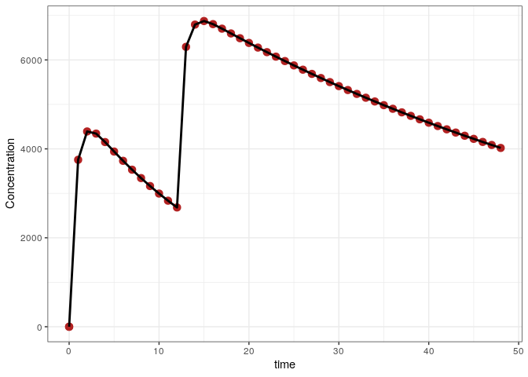
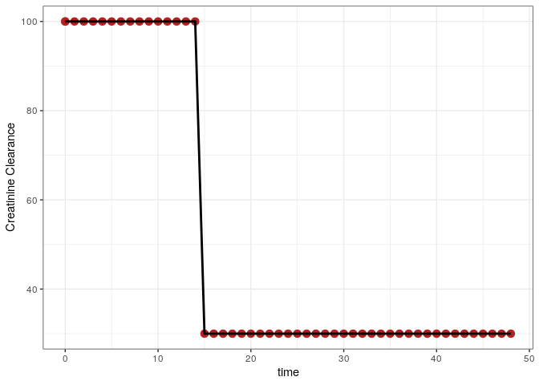

Time-varying covariates with mrgsolve and NONMEM
================
Metrum Research Group

# Introduction

This document runs simulations from a pharmacokinetic model that
involves time-varying covariates and compares the result. A
more-comprehensive comparision of different dosing scenarios is provided
in this repository, but in another document.

All of the relevant code is presented so that the user can trace how the
simulations are performed. The complete source code can be viewed
[here](nmtest_time_varying.R).

# Setup

``` r
Sys.setenv(RSTUDIO_PANDOC = "/usr/lib/rstudio-server/bin/pandoc")
```

``` r
.libPaths("/data/Rlibs")
library(mrgsolve)
library(dplyr)
library(readr)
library(ggplot2)
library(parallel)
library(purrr)
library(tidyr)
```

``` r
carry <- c("cmt", "amt","ii", "addl", "rate", "evid", "ss", "WT")
```

# Functions

These functions assemble data sets, run simulations, and gather outputs.
All scenarios are handled in exactly the same way.

## Save `mrgsim` output as a `nonmem` input data set

``` r
to_data_set <- function(x,id=NULL) {
  x <- as.data.frame(x)
  x <- mutate(x, C = '.', DV = '.', cmt = if_else(cmt==0, 2, cmt))
  x <- dplyr::select(x, "C", everything())
  if(is.numeric(id)) x <- mutate(x,ID = id)
  x
}
```

## Save the `nonmem` input data set

``` r
sv <- function(x,file) {
  write.csv(file = file, row.names = FALSE, quote = FALSE, x)
}
```

## Run `nonmem`

``` r
run <- function(number) {
  metrumrg::NONR(number, project = "model", 
                 command = "/opt/NONMEM/nm74gf/nmqual/autolog.pl", 
                 checkrunno=FALSE)
  return(tabread(number))
}
```

## Read in `nonmem` simulation results

``` r
tabread <- function(number) {
  tab <- file.path("model", number, "TAB")
  if(file.exists(tab)) return(read_table(tab, skip=1))
  stop("the run failed")
}
```

## Simulate a scenario with `mrsim`

``` r
sim <- function(x, e,...) {
  mrgsim(x, events = e, carry.out = carry, digits = 5, ...) 
}
```

# The `mrgsim` model

  - `CRCL` is included as a covariate on `CL`
  - Note that we capture both `CRCL` and `CL` for comparison later

<!-- end list -->

``` r
code <- '
$SET req = ""
$PARAM TVCL = 1.1, V = 20, KA = 1.5
LAGT = 0, MODE = 0, DUR2 = 2, RAT2 = 10, BIOAV = 1, 
CRCL = 100

$PKMODEL cmt = "GUT CENT", depot = TRUE

$MAIN
double CL = TVCL*(CRCL/100); 

$TABLE
capture DV = (CENT/(V/1000));
capture CP = DV;

$CAPTURE LAGT MODE DUR2 RAT2 BIOAV CRCL CL
'

mod <- mcode_cache("tests2", code)
```

    . Building tests2 ... done.

``` r
mod <- update(mod, end = 48, delta = 1)
```

# Assemble the scenarios

  - We are only testing one dosing intervention here. The focus is
    seeing what happens with time-varying covariates.

<!-- end list -->

``` r
env <- new.env()
env$ev <- list()
env$descr <- list()
push_back <- function(env,ev,descr) {
  n <- length(env$ev)+1
  m <- length(env$descr)+1
  env$ev[[n]] <- ev
  env$descr[[m]] <- descr
}
```

``` r
ev <- ev(amt = 100, ii = 12, addl = 1) 
push_back(env,ev, "Bolus with additional")

update_id <- function(ev,id) mutate(ev, ID = id)

runs <- tibble(ev = env$ev, descr = env$descr)
runs <- mutate(runs, ID = seq(n()))
runs <- mutate(runs,ev = map2(ev,ID, update_id))
runs <- mutate(runs, sims = mclapply(ev, sim, x = mod))

runs <- mutate(runs, data = map(sims, to_data_set))
```

# The input data set

``` r
data <- runs[["data"]] %>% bind_rows()
```

``` r
head(data)
```

    .   C ID time evid amt cmt ss ii addl rate LAGT MODE DUR2 RAT2 BIOAV CRCL  CL DV
    . 1 .  1    0    0   0   2  0  0    0    0    0    0    2   10     1  100 1.1  .
    . 2 .  1    0    1 100   1  0 12    1    0    0    0    2   10     1  100 1.1  .
    . 3 .  1    1    0   0   2  0  0    0    0    0    0    2   10     1  100 1.1  .
    . 4 .  1    2    0   0   2  0  0    0    0    0    0    2   10     1  100 1.1  .
    . 5 .  1    3    0   0   2  0  0    0    0    0    0    2   10     1  100 1.1  .
    . 6 .  1    4    0   0   2  0  0    0    0    0    0    2   10     1  100 1.1  .
    .       CP
    . 1    0.0
    . 2    0.0
    . 3 3754.4
    . 4 4391.2
    . 5 4343.2
    . 6 4152.5

Add a weight column to the data

``` r
set.seed(10010)
crcl <- distinct(data,ID,time) %>% mutate(CRCL = ifelse(time >=15, 30,100))

data <- data %>% select(-CRCL) %>% left_join(crcl)
```

    . Joining, by = c("ID", "time")

``` r
data <- select(data, C,ID,time,CRCL,everything())
```

``` r
head(data)
```

    .   C ID time CRCL evid amt cmt ss ii addl rate LAGT MODE DUR2 RAT2 BIOAV  CL DV
    . 1 .  1    0  100    0   0   2  0  0    0    0    0    0    2   10     1 1.1  .
    . 2 .  1    0  100    1 100   1  0 12    1    0    0    0    2   10     1 1.1  .
    . 3 .  1    1  100    0   0   2  0  0    0    0    0    0    2   10     1 1.1  .
    . 4 .  1    2  100    0   0   2  0  0    0    0    0    0    2   10     1 1.1  .
    . 5 .  1    3  100    0   0   2  0  0    0    0    0    0    2   10     1 1.1  .
    . 6 .  1    4  100    0   0   2  0  0    0    0    0    0    2   10     1 1.1  .
    .       CP
    . 1    0.0
    . 2    0.0
    . 3 3754.4
    . 4 4391.2
    . 5 4343.2
    . 6 4152.5

And resimulate so that `CL` is a function of `CRCL`

``` r
sims <- mrgsim_d(mod, data, digits=5, recsort = 4)
```

Notice that we simulated with `recsort` equal to 4. This is important to
control record sort order when scheduling doses via `addl`. This is
important even when simulating from a data set that includes observation
records.

``` r
sv(data, "data/3002.csv")
```

# Simulate with `nonmem`

``` r
out <- run(3002)
```

    . Run 3002 complete.

    . NONR complete.

    . Parsed with column specification:
    . cols(
    .   ID = col_double(),
    .   TIME = col_double(),
    .   CRCL = col_double(),
    .   CL = col_double(),
    .   CP = col_double()
    . )

# Summary

``` r
sims <- mutate(sims, NONMEM = out$CP, MRGSIM = CP, CLNM = out$CL, CLMG = CL, 
               CRCLNM = out$CRCL, CRCLMG = CRCL)
```

``` r
head(sims)
```

    . # A tibble: 6 x 17
    .      ID  time  LAGT  MODE  DUR2  RAT2 BIOAV  CRCL    CL    DV    CP NONMEM
    .   <dbl> <dbl> <dbl> <dbl> <dbl> <dbl> <dbl> <dbl> <dbl> <dbl> <dbl>  <dbl>
    . 1     1     0     0     0     2    10     1   100   1.1    0     0      0 
    . 2     1     0     0     0     2    10     1   100   1.1    0     0      0 
    . 3     1     1     0     0     2    10     1   100   1.1 3754. 3754.  3754.
    . 4     1     2     0     0     2    10     1   100   1.1 4391. 4391.  4391.
    . 5     1     3     0     0     2    10     1   100   1.1 4343. 4343.  4343.
    . 6     1     4     0     0     2    10     1   100   1.1 4152. 4152.  4152.
    . # … with 5 more variables: MRGSIM <dbl>, CLNM <dbl>, CLMG <dbl>, CRCLNM <dbl>,
    . #   CRCLMG <dbl>

## Numerical summary

``` r
summary(sims$NONMEM - sims$MRGSIM)
```

    .    Min. 1st Qu.  Median    Mean 3rd Qu.    Max. 
    .       0       0       0       0       0       0

## Concentration versus time

``` r
ggplot(sims) + 
  geom_point(aes(time,NONMEM),col="firebrick",size=3) + 
  geom_line(aes(time,MRGSIM), lwd=1) + theme_bw() + 
  ylab("Concentration")
```

<!-- -->

## Clearance versus time

``` r
ggplot(sims) + 
  geom_point(aes(time,CLNM),col="firebrick",size=3) + 
  geom_line(aes(time,CLMG), lwd=1) + theme_bw() + 
  ylab("Clearance")
```

<!-- -->

## CRCL versus time

``` r
ggplot(sims) + 
  geom_point(aes(time,CRCLNM),col="firebrick",size=3) + 
  geom_line(aes(time,CRCLMG), lwd=1) + theme_bw() + 
  ylab("Creatinine Clearance")
```

<!-- -->
