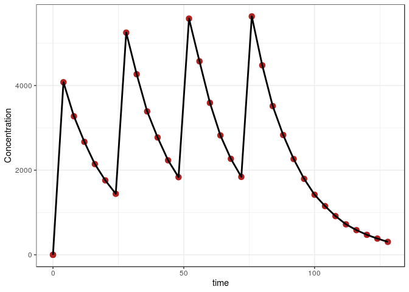
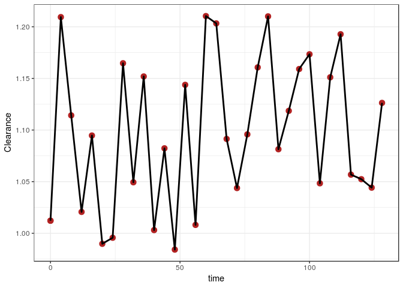
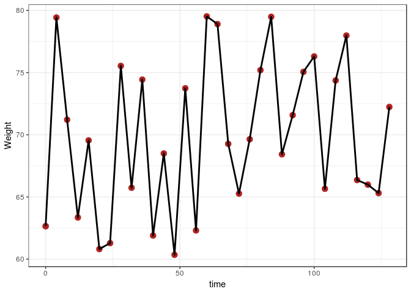

Time-varying covariates with mrgsolve and NONMEM
================
Metrum Research Group

-   [Introduction](#introduction)
-   [Setup](#setup)
-   [Functions](#functions)
    -   [Save `mrgsim` output as a `nonmem` input data set](#save-mrgsim-output-as-a-nonmem-input-data-set)
    -   [Save the `nonmem` input data set](#save-the-nonmem-input-data-set)
    -   [Run `nonmem`](#run-nonmem)
    -   [Read in `nonmem` simulation results](#read-in-nonmem-simulation-results)
    -   [Simulate a scenario with `mrsim`](#simulate-a-scenario-with-mrsim)
-   [The `mrgsim` model](#the-mrgsim-model)
-   [Assemble the scenarios](#assemble-the-scenarios)
-   [The input data set](#the-input-data-set)
-   [Simulate with `nonmem`](#simulate-with-nonmem)
-   [Summary](#summary)
    -   [Numerical summary](#numerical-summary)
    -   [Concentration versus time](#concentration-versus-time)
    -   [Clearance versus time](#clearance-versus-time)
    -   [Weight versus time](#weight-versus-time)

Introduction
============

This document runs simulations from a pharmacokinetic model that involves time-varying covariates and compares the result. A more-comprehensive comparision of different dosing scenarios is provided in this repository, but in another document.

All of the relevant code is presented so that the user can trace how the simulations are performed. The complete source code can be viewed [here](nmtest_time_varying.R).

Setup
=====

``` r
Sys.setenv(RSTUDIO_PANDOC = "/usr/lib/rstudio-server/bin/pandoc")
```

``` r
.libPaths("/data/Rlibs")
library(mrgsolve)
library(dplyr)
library(readr)
library(ggplot2)
library(parallel)
library(purrr)
library(tidyr)
```

``` r
carry <- c("cmt", "amt","ii", "addl", "rate", "evid", "ss", "WT")
```

Functions
=========

These functions assemble data sets, run simulations, and gather outputs. All scenarios are handled in exactly the same way.

Save `mrgsim` output as a `nonmem` input data set
-------------------------------------------------

``` r
to_data_set <- function(x,id=NULL) {
  x <- as.data.frame(x)
  x <- mutate(x, C = '.', DV = '.', cmt = if_else(cmt==0, 2, cmt))
  x <- dplyr::select(x, "C", everything())
  if(is.numeric(id)) x <- mutate(x,ID = id)
  x
}
```

Save the `nonmem` input data set
--------------------------------

``` r
sv <- function(x,file) {
  write.csv(file = file, row.names = FALSE, quote = FALSE, x)
}
```

Run `nonmem`
------------

``` r
run <- function(number) {
  metrumrg::NONR(number, project = "model", 
                 command = "/opt/NONMEM/nm74/nmqual/autolog.pl", 
                 checkrunno=FALSE)
  return(tabread(number))
}
```

Read in `nonmem` simulation results
-----------------------------------

``` r
tabread <- function(number) {
  tab <- file.path("model", number, "TAB")
  if(file.exists(tab)) return(read_table(tab, skip=1))
  stop("the run failed")
}
```

Simulate a scenario with `mrsim`
--------------------------------

``` r
sim <- function(x, e,...) {
  mrgsim(x, events = e, carry.out = carry, digits = 5, ...) 
}
```

The `mrgsim` model
==================

-   `WT` is included as a covariate on `CL`
-   Note that we capture both `WT` and `CL` for comparison later

``` r
code <- '
$SET req = ""
$PARAM TVCL = 1.1, V = 20, KA = 1.5
LAGT = 0, MODE = 0, DUR2 = 2, RAT2 = 10, BIOAV = 1, 
WT = 70

$PKMODEL cmt = "GUT CENT", depot = TRUE

$MAIN
double CL = TVCL*pow(WT/70,0.75); 

$TABLE
capture DV = (CENT/(V/1000));
capture CP = DV;

$CAPTURE LAGT MODE DUR2 RAT2 BIOAV WT CL
'

mod <- mcode_cache("tests1", code)
```

    . Building tests1 ... done.

``` r
mod <- update(mod, end=130, delta = 4)
```

Assemble the scenarios
======================

-   We are only testing one dosing intervention here. The focus is seeing what happens with time-varying covariates.

``` r
env <- new.env()
env$ev <- list()
env$descr <- list()
push_back <- function(env,ev,descr) {
  n <- length(env$ev)+1
  m <- length(env$descr)+1
  env$ev[[n]] <- ev
  env$descr[[m]] <- descr
}
```

``` r
ev <- ev(amt = 100, ii = 24, addl = 3) 
push_back(env,ev, "Bolus with additional")

update_id <- function(ev,id) mutate(ev, ID = id)

runs <- tibble(ev = env$ev, descr = env$descr)
runs <- mutate(runs, ID = seq(n()))
runs <- mutate(runs,ev = map2(ev,ID, update_id))
runs <- mutate(runs, sims = mclapply(ev, sim, x = mod))

runs <- mutate(runs, data = map(sims, to_data_set))
```

The input data set
==================

``` r
data <- runs[["data"]] %>% bind_rows()
```

``` r
head(data)
```

    .   C ID time evid amt cmt ss ii addl rate LAGT MODE DUR2 RAT2 BIOAV WT  CL
    . 1 .  1    0    0   0   2  0  0    0    0    0    0    2   10     1 70 1.1
    . 2 .  1    0    1 100   1  0 24    3    0    0    0    2   10     1 70 1.1
    . 3 .  1    4    0   0   2  0  0    0    0    0    0    2   10     1 70 1.1
    . 4 .  1    8    0   0   2  0  0    0    0    0    0    2   10     1 70 1.1
    . 5 .  1   12    0   0   2  0  0    0    0    0    0    2   10     1 70 1.1
    . 6 .  1   16    0   0   2  0  0    0    0    0    0    2   10     1 70 1.1
    .   DV     CP
    . 1  .    0.0
    . 2  .    0.0
    . 3  . 4152.5
    . 4  . 3342.7
    . 5  . 2682.6
    . 6  . 2152.9

Add a weight column to the data

``` r
set.seed(10010)
wt <- distinct(data,ID,time) %>% mutate(WT = round(runif(n(), 60,80),2))

data <- data %>% select(-WT) %>% left_join(wt)
```

    . Joining, by = c("ID", "time")

``` r
data <- select(data, C,ID,time,WT,everything())
```

``` r
head(data)
```

    .   C ID time    WT evid amt cmt ss ii addl rate LAGT MODE DUR2 RAT2 BIOAV
    . 1 .  1    0 62.65    0   0   2  0  0    0    0    0    0    2   10     1
    . 2 .  1    0 62.65    1 100   1  0 24    3    0    0    0    2   10     1
    . 3 .  1    4 79.43    0   0   2  0  0    0    0    0    0    2   10     1
    . 4 .  1    8 71.21    0   0   2  0  0    0    0    0    0    2   10     1
    . 5 .  1   12 63.35    0   0   2  0  0    0    0    0    0    2   10     1
    . 6 .  1   16 69.55    0   0   2  0  0    0    0    0    0    2   10     1
    .    CL DV     CP
    . 1 1.1  .    0.0
    . 2 1.1  .    0.0
    . 3 1.1  . 4152.5
    . 4 1.1  . 3342.7
    . 5 1.1  . 2682.6
    . 6 1.1  . 2152.9

And resimulate so that `CL` is a function of `WT`

``` r
sims <- mrgsim_d(mod, data, digits=5, recsort = 4)
```

    . Dropping non-numeric columns: 
    .   C DV

Notice that we simulated with `recsort` equal to 4. This is important to control record sort order when scheduling doses via `addl`. This is important even when simulating from a data set that includes observation records.

``` r
sv(data, "data/3001.csv")
```

Simulate with `nonmem`
======================

``` r
out <- run(3001)
```

    . Run 3001 complete.

    . NONR complete.

    . Parsed with column specification:
    . cols(
    .   ID = col_double(),
    .   TIME = col_double(),
    .   WT = col_double(),
    .   CL = col_double(),
    .   CP = col_double()
    . )

Summary
=======

``` r
sims <- mutate(sims, NONMEM = out$CP, MRGSIM = CP, CLNM = out$CL, CLMG = CL, 
               WTNM = out$WT, WTMG = WT)
```

``` r
head(sims)
```

    . # A tibble: 6 x 17
    .      ID  time  LAGT  MODE  DUR2  RAT2 BIOAV    WT    CL    DV    CP NONMEM
    .   <dbl> <dbl> <dbl> <dbl> <dbl> <dbl> <dbl> <dbl> <dbl> <dbl> <dbl>  <dbl>
    . 1     1     0     0     0     2    10     1  62.6  1.01    0     0      0 
    . 2     1     0     0     0     2    10     1  62.6  1.01    0     0      0 
    . 3     1     4     0     0     2    10     1  79.4  1.21 4078. 4078.  4078.
    . 4     1     8     0     0     2    10     1  71.2  1.11 3274. 3274.  3274.
    . 5     1    12     0     0     2    10     1  63.4  1.02 2669. 2669.  2669.
    . 6     1    16     0     0     2    10     1  69.6  1.09 2144. 2144.  2144.
    . # … with 5 more variables: MRGSIM <dbl>, CLNM <dbl>, CLMG <dbl>,
    . #   WTNM <dbl>, WTMG <dbl>

Numerical summary
-----------------

``` r
summary(sims$NONMEM - sims$MRGSIM)
```

    .    Min. 1st Qu.  Median    Mean 3rd Qu.    Max. 
    .       0       0       0       0       0       0

Concentration versus time
-------------------------

``` r
ggplot(sims) + 
  geom_point(aes(time,NONMEM),col="firebrick",size=3) + 
  geom_line(aes(time,MRGSIM), lwd=1) + theme_bw() + 
  ylab("Concentration")
```



Clearance versus time
---------------------

``` r
ggplot(sims) + 
  geom_point(aes(time,CLNM),col="firebrick",size=3) + 
  geom_line(aes(time,CLMG), lwd=1) + theme_bw() + 
  ylab("Clearance")
```



Weight versus time
------------------

``` r
ggplot(sims) + 
  geom_point(aes(time,WTNM),col="firebrick",size=3) + 
  geom_line(aes(time,WTMG), lwd=1) + theme_bw() + 
  ylab("Weight")
```


