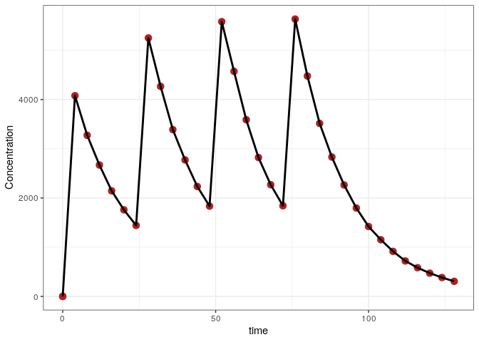
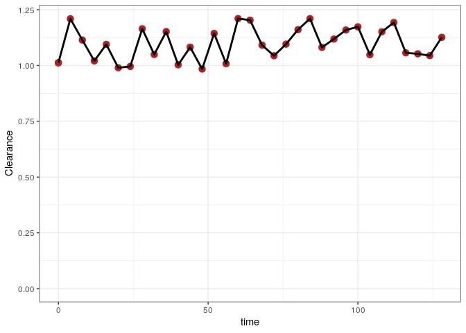
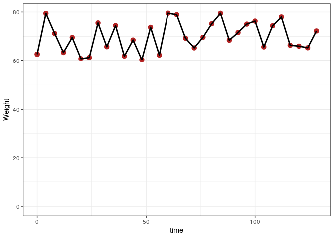

Time-varying covariates with mrgsolve and NONMEM
================
Metrum Research Group

-   [Introduction](#introduction)
-   [Setup](#setup)
-   [The `mrgsim` model](#the-mrgsim-model)
-   [Assemble the scenarios](#assemble-the-scenarios)
-   [The input data set](#the-input-data-set)
-   [Simulate with `nonmem`](#simulate-with-nonmem)
-   [Summary](#summary)
    -   [Numerical summary](#numerical-summary)
    -   [Concentration versus time](#concentration-versus-time)
    -   [Clearance versus time](#clearance-versus-time)
    -   [Weight versus time](#weight-versus-time)
-   [Control stream](#control-stream)
-   [Session Info](#session-info)

# Introduction

This document runs simulations from a pharmacokinetic model that
involves time-varying covariates and compares the result. A
more-comprehensive comparision of different dosing scenarios is provided
in this repository, but in another document.

All of the relevant code is presented so that the user can trace how the
simulations are performed. The complete source code can be viewed
[here](nmtest_time_varying.R).

# Setup

``` r
Sys.setenv(RSTUDIO_PANDOC = "/usr/lib/rstudio-server/bin/pandoc")
```

``` r
library(mrgsolve)
library(dplyr)
library(data.table)
library(ggplot2)
library(parallel)
library(purrr)
library(here)
library(tools)
library(jsonlite)

source(here("shared", "tools.R"))
```

# The `mrgsim` model

-   `WT` is included as a covariate on `CL`
-   Note that we capture both `WT` and `CL` for comparison later

``` r
mod <- mread("2001.mod")
```

    . Building 2001_mod ... done.

``` r
mod <- update(mod, end = 130, delta = 4)
```

# Assemble the scenarios

-   We are only testing one dosing intervention here. The focus is
    seeing what happens with time-varying covariates.

``` r
env <- new.env()
env$ev <- list()
env$descr <- list()
push_back <- function(env,ev,descr) {
  n <- length(env$ev)+1
  m <- length(env$descr)+1
  env$ev[[n]] <- ev
  env$descr[[m]] <- descr
}
```

``` r
ev <- ev(amt = 100, ii = 24, addl = 3) 
push_back(env,ev, "Bolus with additional")

update_id <- function(ev,id) mutate(ev, ID = id)

runs <- tibble(ev = env$ev, descr = env$descr)
runs <- mutate(runs, ID = seq(n()))
runs <- mutate(runs,ev = map2(ev,ID, update_id))
runs <- mutate(runs, sims = lapply(ev, sim, x = mod))
runs <- mutate(runs, data = map(sims, to_data_set))
```

# The input data set

``` r
data <- bind_rows(runs$data)
```

``` r
head(data)
```

    .   C ID time evid amt cmt ss ii addl rate LAGT MODE DUR2 RAT2 BIOAV WT  CL DV
    . 1 .  1    0    1 100   1  0 24    3    0    0    0    2   10     1 70 1.1  .
    . 2 .  1    0    0   0   2  0  0    0    0    0    0    2   10     1 70 1.1  .
    . 3 .  1    4    0   0   2  0  0    0    0    0    0    2   10     1 70 1.1  .
    . 4 .  1    8    0   0   2  0  0    0    0    0    0    2   10     1 70 1.1  .
    . 5 .  1   12    0   0   2  0  0    0    0    0    0    2   10     1 70 1.1  .
    . 6 .  1   16    0   0   2  0  0    0    0    0    0    2   10     1 70 1.1  .
    .       CP
    . 1    0.0
    . 2    0.0
    . 3 4152.5
    . 4 3342.7
    . 5 2682.6
    . 6 2152.9

Add a weight column to the data

``` r
set.seed(10010)
wt <- distinct(data, ID, time) %>% 
  mutate(WT = round(runif(n(), 60,80),2))

data <- select(data, -WT) %>% left_join(wt)
```

    . Joining, by = c("ID", "time")

``` r
data <- select(data, C, ID, time, WT, everything())
```

``` r
head(data)
```

    .   C ID time    WT evid amt cmt ss ii addl rate LAGT MODE DUR2 RAT2 BIOAV  CL DV
    . 1 .  1    0 62.65    1 100   1  0 24    3    0    0    0    2   10     1 1.1  .
    . 2 .  1    0 62.65    0   0   2  0  0    0    0    0    0    2   10     1 1.1  .
    . 3 .  1    4 79.43    0   0   2  0  0    0    0    0    0    2   10     1 1.1  .
    . 4 .  1    8 71.21    0   0   2  0  0    0    0    0    0    2   10     1 1.1  .
    . 5 .  1   12 63.35    0   0   2  0  0    0    0    0    0    2   10     1 1.1  .
    . 6 .  1   16 69.55    0   0   2  0  0    0    0    0    0    2   10     1 1.1  .
    .       CP
    . 1    0.0
    . 2    0.0
    . 3 4152.5
    . 4 3342.7
    . 5 2682.6
    . 6 2152.9

And resimulate so that `CL` is a function of `WT`

``` r
sims <- mrgsim_d(mod, data, digits = 5, recsort = 4, output = "df")
```

Notice that we simulated with `recsort` equal to 4. This is important to
control record sort order when scheduling doses via `addl`. This is
important even when simulating from a data set that includes observation
records.

``` r
fsave(data, "data/2001.csv")
```

# Simulate with `nonmem`

``` r
nm <- psn_execute(2001)
```

# Summary

``` r
comp <- mutate(
  sims, 
  NONMEM = nm$CP, 
  MRGSIM = CP, 
  CLNM = nm$CL, 
  CLMG = CL, 
  WTNM = nm$WT, 
  WTMG = WT
)
```

``` r
head(comp)
```

    .   ID time LAGT MODE DUR2 RAT2 BIOAV    WT     CL     DV     CP NONMEM MRGSIM
    . 1  1    0    0    0    2   10     1 62.65 1.0122    0.0    0.0    0.0    0.0
    . 2  1    0    0    0    2   10     1 62.65 1.0122    0.0    0.0    0.0    0.0
    . 3  1    4    0    0    2   10     1 79.43 1.2094 4077.8 4077.8 4077.8 4077.8
    . 4  1    8    0    0    2   10     1 71.21 1.1142 3273.5 3273.5 3273.5 3273.5
    . 5  1   12    0    0    2   10     1 63.35 1.0207 2669.1 2669.1 2669.1 2669.1
    . 6  1   16    0    0    2   10     1 69.55 1.0947 2144.2 2144.2 2144.2 2144.2
    .     CLNM   CLMG  WTNM  WTMG
    . 1 1.0122 1.0122 62.65 62.65
    . 2 1.0122 1.0122 62.65 62.65
    . 3 1.2094 1.2094 79.43 79.43
    . 4 1.1142 1.1142 71.21 71.21
    . 5 1.0207 1.0207 63.35 63.35
    . 6 1.0947 1.0947 69.55 69.55

## Numerical summary

``` r
summary(comp$NONMEM - comp$MRGSIM)
```

    .    Min. 1st Qu.  Median    Mean 3rd Qu.    Max. 
    .       0       0       0       0       0       0

## Concentration versus time

``` r
ggplot(comp) + 
  geom_point(aes(time, NONMEM), col = "firebrick", size = 3) + 
  geom_line(aes(time, MRGSIM), lwd=1) + theme_bw() + 
  ylab("Concentration")
```

<!-- -->

## Clearance versus time

``` r
ggplot(comp) + 
  geom_point(aes(time, CLNM), col = "firebrick", size = 3) + 
  geom_line(aes(time, CLMG), lwd=1) + theme_bw() + 
  ylab("Clearance") + 
  ylim(0, NA)
```

<!-- -->

## Weight versus time

``` r
ggplot(comp) + 
  geom_point(aes(time, WTNM),col = "firebrick", size = 3) + 
  geom_line(aes(time, WTMG), lwd = 1) + theme_bw() + 
  ylim(0, NA) + 
  ylab("Weight")
```

<!-- -->

# Control stream

``` r
writeLines(readLines("2001/2001.lst"))
```

       Wed Mar 30 10:08:14 EDT 2022
       $PROBLEM    RUN 2001 ; see time-varying-vignette.R
       $INPUT      C ID TIME WT EVID AMT CMT SS II ADDL RATE LAGT MODE DUR2
                   RAT2 BIOAV DV
       $DATA      2001.csv IGNORE=C
       $SUBROUTINE ADVAN2 TRANS2
       $PK
       
       TVCL=THETA(1)*(WT/70)**0.75
       CL=TVCL*EXP(ETA(1))
       
       TVV2=THETA(2)
       V=TVV2*EXP(ETA(2))
       
       TVKA=THETA(3)
       KA=TVKA*EXP(ETA(3))
       
       $ERROR
       IPRED=A(2)/(V/1000)
       Y=IPRED*EXP(ERR(1))
       
       CP = IPRED
       
       $THETA  1.1 FIX ; ; CL
        20 FIX ; _; V
        1.5 FIX ; __; KA
       $OMEGA  0.0  FIX
        0.0  FIX
        0.0  FIX
       $SIGMA  0.00  FIX
       $TABLE      FILE=TAB ID TIME WT CL CP NOPRINT ONEHEADER NOAPPEND
       $SIMULATION (2674474) ONLYSIMULATION
       
       
       NM-TRAN MESSAGES
         
        WARNINGS AND ERRORS (IF ANY) FOR PROBLEM    1
                    
        (WARNING  2) NM-TRAN INFERS THAT THE DATA ARE POPULATION.
       
        (DATA WARNING   5) RECORD         1, DATA ITEM  17, CONTENTS: 1.1
        THE DV DATA ITEM IS POSITIVE, BUT THE MDV DATA ITEM IS 1
       
       License Registered to: Metrum Research Group (with RADAR5NM)
       Expiration Date:    14 JUL 2022
       Current Date:       30 MAR 2022
       Days until program expires : 104
       1NONLINEAR MIXED EFFECTS MODEL PROGRAM (NONMEM) VERSION 7.5.0
        ORIGINALLY DEVELOPED BY STUART BEAL, LEWIS SHEINER, AND ALISON BOECKMANN
        CURRENT DEVELOPERS ARE ROBERT BAUER, ICON DEVELOPMENT SOLUTIONS,
        AND ALISON BOECKMANN. IMPLEMENTATION, EFFICIENCY, AND STANDARDIZATION
        PERFORMED BY NOUS INFOSYSTEMS.
       
        PROBLEM NO.:         1
        RUN 2001 ; see time-varying-vignette.R
       0DATA CHECKOUT RUN:              NO
        DATA SET LOCATED ON UNIT NO.:    2
        THIS UNIT TO BE REWOUND:        NO
        NO. OF DATA RECS IN DATA SET:       34
        NO. OF DATA ITEMS IN DATA SET:  18
        ID DATA ITEM IS DATA ITEM NO.:   2
        DEP VARIABLE IS DATA ITEM NO.:  17
        MDV DATA ITEM IS DATA ITEM NO.: 18
       0INDICES PASSED TO SUBROUTINE PRED:
          5   3   6  11   8   9   7   0   0   0  10
       0LABELS FOR DATA ITEMS:
        C ID TIME WT EVID AMT CMT SS II ADDL RATE LAGT MODE DUR2 RAT2 BIOAV DV MDV
       0(NONBLANK) LABELS FOR PRED-DEFINED ITEMS:
        CL CP
       0FORMAT FOR DATA:
        (2E2.0,E4.0,E6.0,E2.0,E4.0,2E2.0,E3.0,5E2.0,E3.0,E2.0,E4.0,1F2.0)
       
        TOT. NO. OF OBS RECS:       33
        TOT. NO. OF INDIVIDUALS:        1
       0LENGTH OF THETA:   3
       0DEFAULT THETA BOUNDARY TEST OMITTED:    NO
       0OMEGA HAS SIMPLE DIAGONAL FORM WITH DIMENSION:   3
       0DEFAULT OMEGA BOUNDARY TEST OMITTED:    NO
       0SIGMA HAS SIMPLE DIAGONAL FORM WITH DIMENSION:   1
       0DEFAULT SIGMA BOUNDARY TEST OMITTED:    NO
       0INITIAL ESTIMATE OF THETA:
        LOWER BOUND    INITIAL EST    UPPER BOUND
         0.1100E+01     0.1100E+01     0.1100E+01
         0.2000E+02     0.2000E+02     0.2000E+02
         0.1500E+01     0.1500E+01     0.1500E+01
       0INITIAL ESTIMATE OF OMEGA:
        0.0000E+00
        0.0000E+00   0.0000E+00
        0.0000E+00   0.0000E+00   0.0000E+00
       0OMEGA CONSTRAINED TO BE THIS INITIAL ESTIMATE
       0INITIAL ESTIMATE OF SIGMA:
        0.0000E+00
       0SIGMA CONSTRAINED TO BE THIS INITIAL ESTIMATE
       0SIMULATION STEP OMITTED:    NO
        OBJ FUNC EVALUATED:         NO
        ORIGINAL DATA USED ON EACH NEW SIMULATION:         NO
        SEEDS RESET ON EACH NEW SUPERSET ITERATION:        YES
       0SIMULATION RANDOM METHOD SELECTED (RANMETHOD): 4U
       SEED   1 RESET TO INITIAL: YES
        SOURCE   1:
          SEED1:       2674474   SEED2:             0   PSEUDO-NORMAL
       0WARNING: NO. OF OBS RECS IN INDIVIDUAL REC NO.      1 (IN INDIVIDUAL
        REC ORDERING) EXCEEDS ONE WHILE INITIAL ESTIMATE OF WITHIN INDIVIDUAL VARIANCE IS ZERO
       0TABLES STEP OMITTED:    NO
        NO. OF TABLES:           1
        SEED NUMBER (SEED):    11456
        RANMETHOD:             3U
        MC SAMPLES (ESAMPLE):    300
        WRES SQUARE ROOT TYPE (WRESCHOL): EIGENVALUE
       0-- TABLE   1 --
       0RECORDS ONLY:    ALL
       04 COLUMNS APPENDED:    NO
        PRINTED:                NO
        HEADER:                YES
        FILE TO BE FORWARDED:   NO
        FORMAT:                S1PE11.4
        IDFORMAT:
        LFORMAT:
        RFORMAT:
        FIXED_EFFECT_ETAS:
       0USER-CHOSEN ITEMS:
        ID TIME WT CL CP
       1DOUBLE PRECISION PREDPP VERSION 7.5.0
       
        ONE COMPARTMENT MODEL WITH FIRST-ORDER ABSORPTION (ADVAN2)
       0MAXIMUM NO. OF BASIC PK PARAMETERS:   3
       0BASIC PK PARAMETERS (AFTER TRANSLATION):
          ELIMINATION RATE (K) IS BASIC PK PARAMETER NO.:  1
          ABSORPTION RATE (KA) IS BASIC PK PARAMETER NO.:  3
       
        TRANSLATOR WILL CONVERT PARAMETERS
        CLEARANCE (CL) AND VOLUME (V) TO K (TRANS2)
       0COMPARTMENT ATTRIBUTES
        COMPT. NO.   FUNCTION   INITIAL    ON/OFF      DOSE      DEFAULT    DEFAULT
                                STATUS     ALLOWED    ALLOWED    FOR DOSE   FOR OBS.
           1         DEPOT        OFF        YES        YES        YES        NO
           2         CENTRAL      ON         NO         YES        NO         YES
           3         OUTPUT       OFF        YES        NO         NO         NO
       1
        ADDITIONAL PK PARAMETERS - ASSIGNMENT OF ROWS IN GG
        COMPT. NO.                             INDICES
                     SCALE      BIOAVAIL.   ZERO-ORDER  ZERO-ORDER  ABSORB
                                FRACTION    RATE        DURATION    LAG
           1            *           *           *           *           *
           2            *           *           *           *           *
           3            *           -           -           -           -
                    - PARAMETER IS NOT ALLOWED FOR THIS MODEL
                    * PARAMETER IS NOT SUPPLIED BY PK SUBROUTINE;
                      WILL DEFAULT TO ONE IF APPLICABLE
       0DATA ITEM INDICES USED BY PRED ARE:
          EVENT ID DATA ITEM IS DATA ITEM NO.:      5
          TIME DATA ITEM IS DATA ITEM NO.:          3
          DOSE AMOUNT DATA ITEM IS DATA ITEM NO.:   6
          DOSE RATE DATA ITEM IS DATA ITEM NO.:    11
          STEADY STATE DATA ITEM IS DATA ITEM NO.:  8
          INTERVAL DATA ITEM IS DATA ITEM NO.:      9
          ADDL. DOSES DATA ITEM IS DATA ITEM NO.:  10
          COMPT. NO. DATA ITEM IS DATA ITEM NO.:    7
       
       0PK SUBROUTINE CALLED WITH EVERY EVENT RECORD.
        PK SUBROUTINE NOT CALLED AT NONEVENT (ADDITIONAL OR LAGGED) DOSE TIMES.
       0ERROR SUBROUTINE CALLED WITH EVERY EVENT RECORD.
       0ERROR SUBROUTINE INDICATES THAT DERIVATIVES OF COMPARTMENT AMOUNTS ARE USED.
       1
        SIMULATION STEP PERFORMED
        SOURCE  1:
           SEED1:     382261626   SEED2:    1058486707
        Elapsed simulation  time in seconds:     0.00
        ESTIMATION STEP OMITTED:                 YES
        Elapsed finaloutput time in seconds:     0.00
        #CPUT: Total CPU Time in Seconds,        0.010
       Stop Time:
       Wed Mar 30 10:08:18 EDT 2022

# Session Info

``` r
options(width = 120)
sessionInfo()
```

    . R version 4.1.1 (2021-08-10)
    . Platform: x86_64-pc-linux-gnu (64-bit)
    . Running under: Ubuntu 18.04.5 LTS
    . 
    . Matrix products: default
    . BLAS:   /usr/lib/x86_64-linux-gnu/openblas/libblas.so.3
    . LAPACK: /usr/lib/x86_64-linux-gnu/libopenblasp-r0.2.20.so
    . 
    . locale:
    .  [1] LC_CTYPE=en_US.UTF-8       LC_NUMERIC=C               LC_TIME=en_US.UTF-8        LC_COLLATE=en_US.UTF-8    
    .  [5] LC_MONETARY=en_US.UTF-8    LC_MESSAGES=en_US.UTF-8    LC_PAPER=en_US.UTF-8       LC_NAME=C                 
    .  [9] LC_ADDRESS=C               LC_TELEPHONE=C             LC_MEASUREMENT=en_US.UTF-8 LC_IDENTIFICATION=C       
    . 
    . attached base packages:
    . [1] tools     parallel  stats     graphics  grDevices datasets  utils     methods   base     
    . 
    . other attached packages:
    . [1] jsonlite_1.8.0    here_1.0.1        purrr_0.3.4       ggplot2_3.3.5     data.table_1.14.2 dplyr_1.0.8      
    . [7] mrgsolve_1.0.3   
    . 
    . loaded via a namespace (and not attached):
    .  [1] Rcpp_1.0.8.3     pillar_1.7.0     compiler_4.1.1   highr_0.9        digest_0.6.29    evaluate_0.15   
    .  [7] lifecycle_1.0.1  tibble_3.1.6     gtable_0.3.0     pkgconfig_2.0.3  rlang_1.0.2      cli_3.2.0       
    . [13] yaml_2.3.5       xfun_0.30        fastmap_1.1.0    withr_2.5.0      stringr_1.4.0    knitr_1.37      
    . [19] generics_0.1.2   vctrs_0.3.8      rprojroot_2.0.2  grid_4.1.1       tidyselect_1.1.2 glue_1.6.2      
    . [25] R6_2.5.1         fansi_1.0.2      rmarkdown_2.13   farver_2.1.0     magrittr_2.0.2   scales_1.1.1    
    . [31] ellipsis_0.3.2   htmltools_0.5.2  colorspace_2.0-3 renv_0.14.0      labeling_0.4.2   utf8_1.2.2      
    . [37] stringi_1.7.6    munsell_0.5.0    crayon_1.5.0
